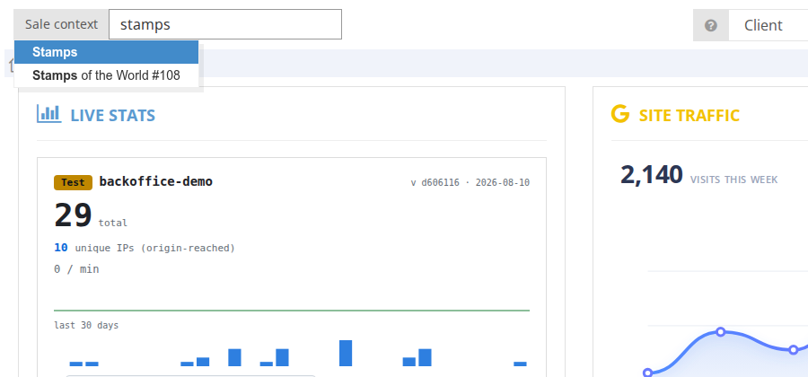
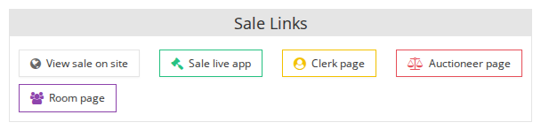
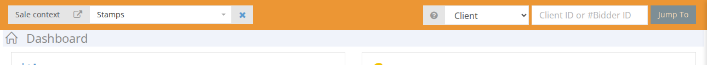

# Accessing your Demo

Choose a sale:  

The applicable “Sale Links” appear in the Sale Links block on the Sale page.  

### Sale Page \(clients\)

The webpage that the online users see during the live auction. Note: that ALL Live App users need to login through this Sale Page first.

### Clerk Page \(staff\)

The webpage for the person who is actually capturing bids and reflecting the auctioneers instructions, like setting the bid to the floor or changing the next bid step.

### Auctioneer Page \(staff\)

The webpage for the person holding the gavel and running the auction in the room. This minimalistic page only displays what the auctioneer requires to run the auction.

### Room Page

This page is used to display the live sale on the monitor in the physical auction room.

To be able to see the system from different roles \(staff or client\) at the same time, please make sure to use separate windows for each role \(one in Chrome and the other in Chrome Incognito\). To get started, you will receive a table like the one below filled out with your relevant access information.

| STAFF \(Chrome browser\) | Page Link | Staff Username | Password |
| :--- | :--- | :--- | :--- |
| Back Office |  |  |  |
| Live App: Clerk page | BackOffice Sale Link |  |  |
| Live App: Auctioneer page | BackOffice Sale Link |  |  |

| CLIENT \(Chrome Incognito\*\) | Page Link | Client Username | Password |
| :--- | :--- | :--- | :--- |
| Website \(eCatalogue\) |  |  |  |
| Live App: Sale page | BackOffice Sale Link |  |  |

\*Chrome in [Incognito](https://en.wikipedia.org/wiki/Private_browsing), you will go to your browser menu, click on File → New Incognito Window.

**Keep in mind:**  
There is a sale context entry at the top. Make sure to select a sale so the ‘Bids’ page and ‘Bidding info’ is exposed.  

Please note the plug icon on the top left hand side of your screen should be green. If it is not, click on re-check connection.  

