# Live Auction Flow

## Item Statuses during the live auction

**Paused -** bidding is on standby.

**Active** - bidding is active. Buyers can place a bid for the current item.

**Going** - bidding is going to close. Buyers can still place a bid for the current item.

**Gone** - the item is closed for bidding and is either sold or unsold.

The clerk changes the item status manually on the Clerk screen, and the status is changed automatically on all other screens \(Auctioneer, Room, and Web\).

| \*\*\*\* | **Paused** | **Active** | **Going** | **Gone** |
| :--- | :--- | :--- | :--- | :--- |
| **Clerk** | 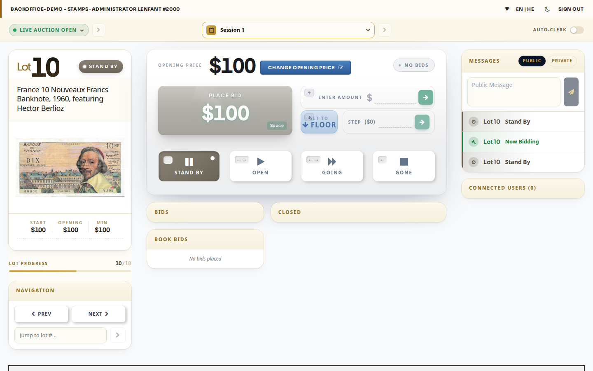 | 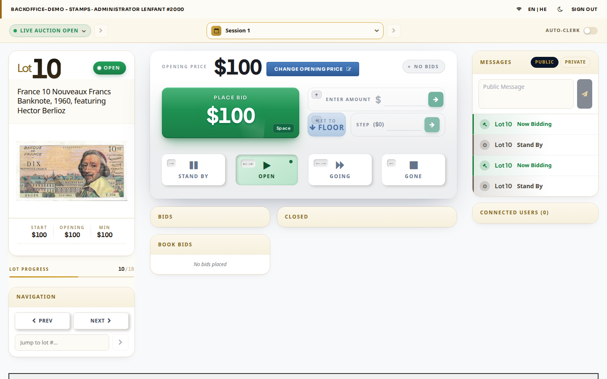 | 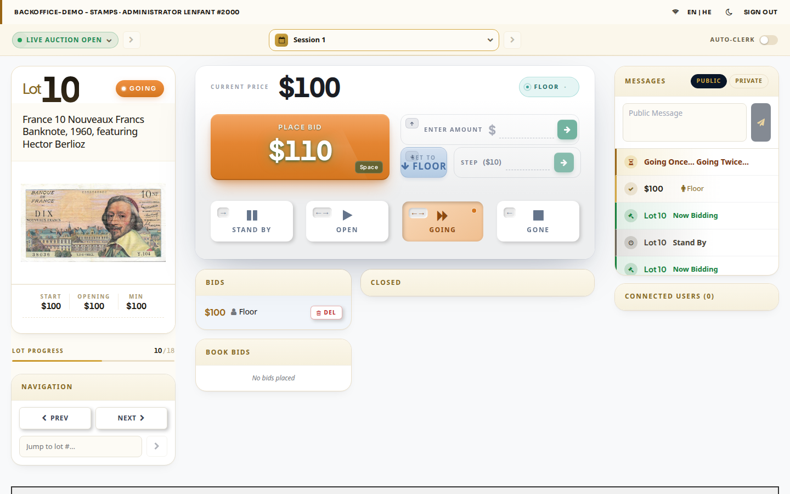 | 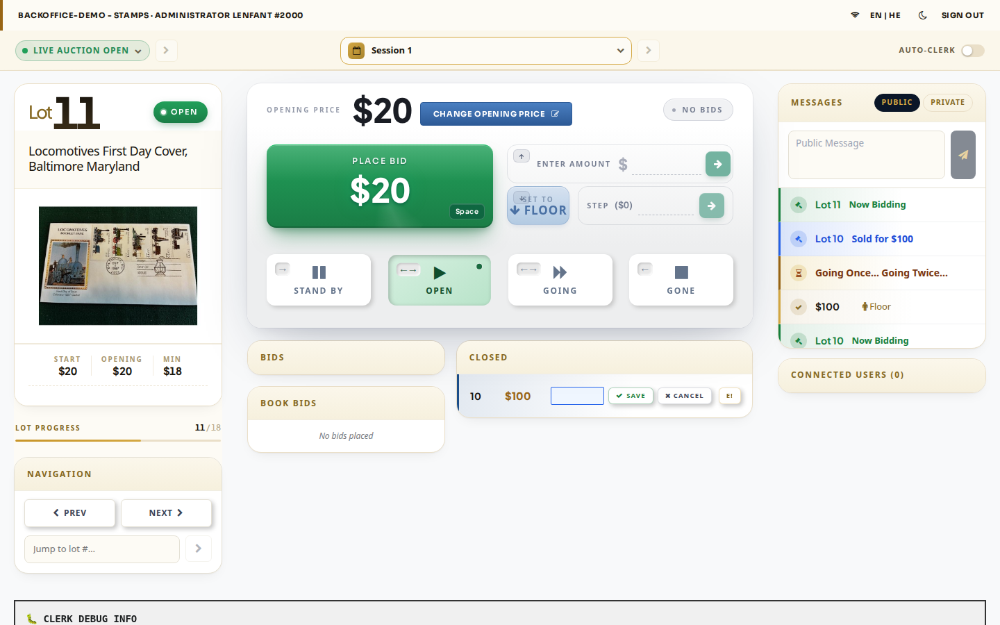 |
| **Auctioneer** | 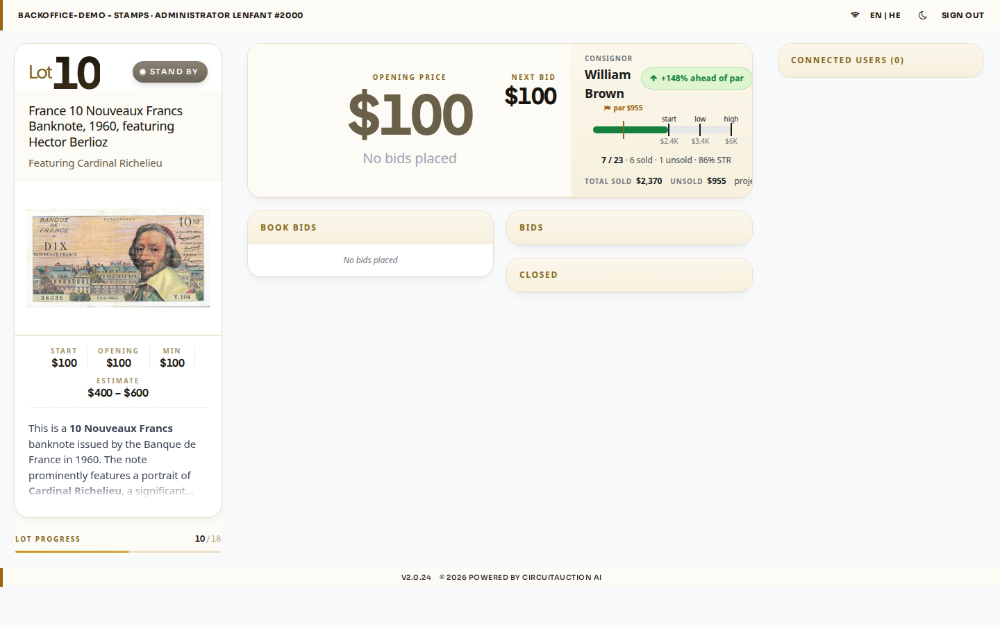 | 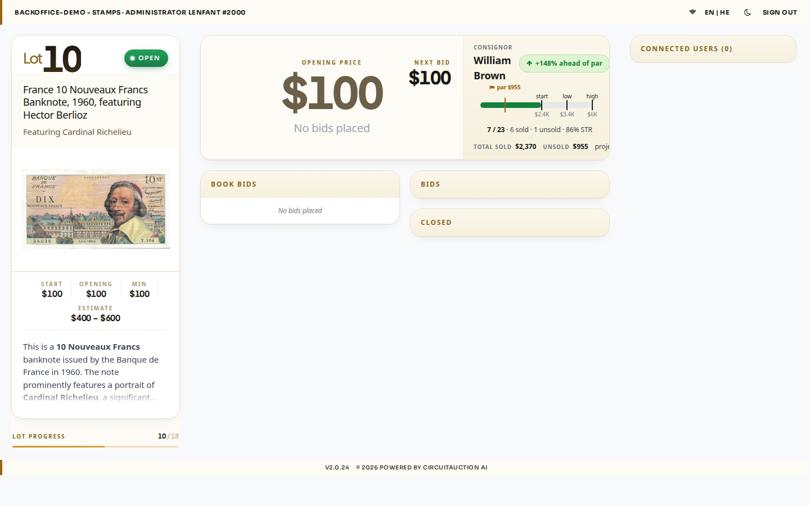 | 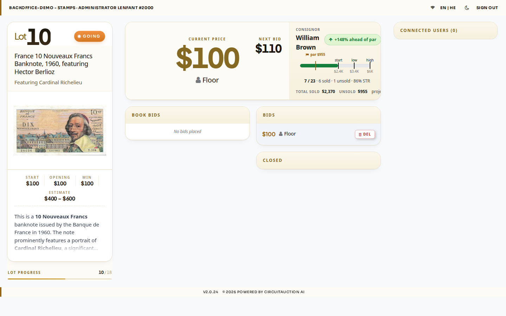 | 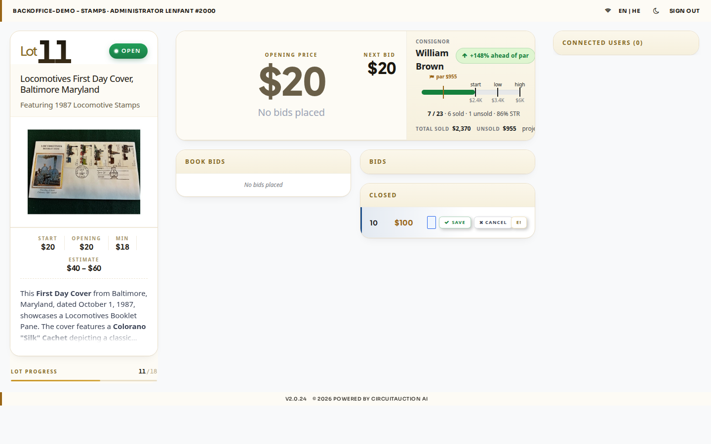 |
| **Room** | 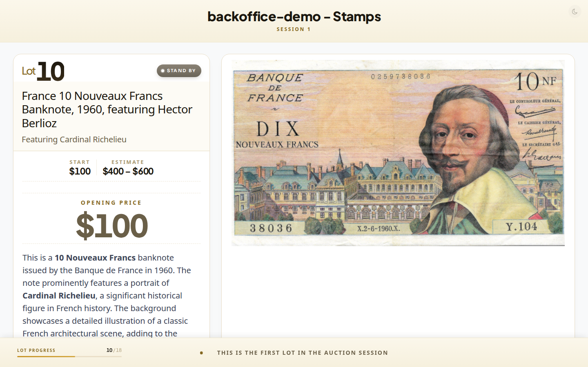 | 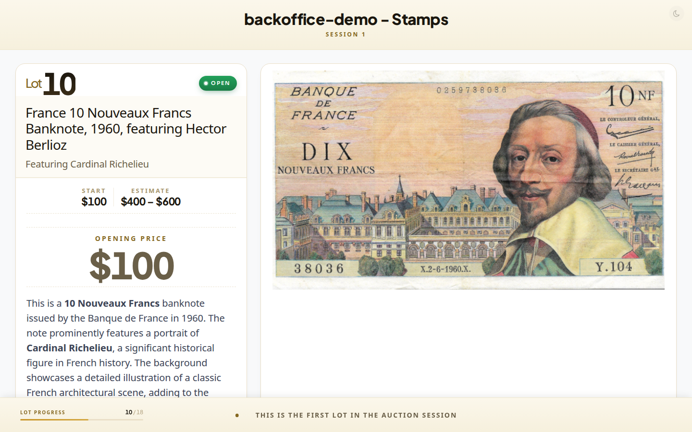 | 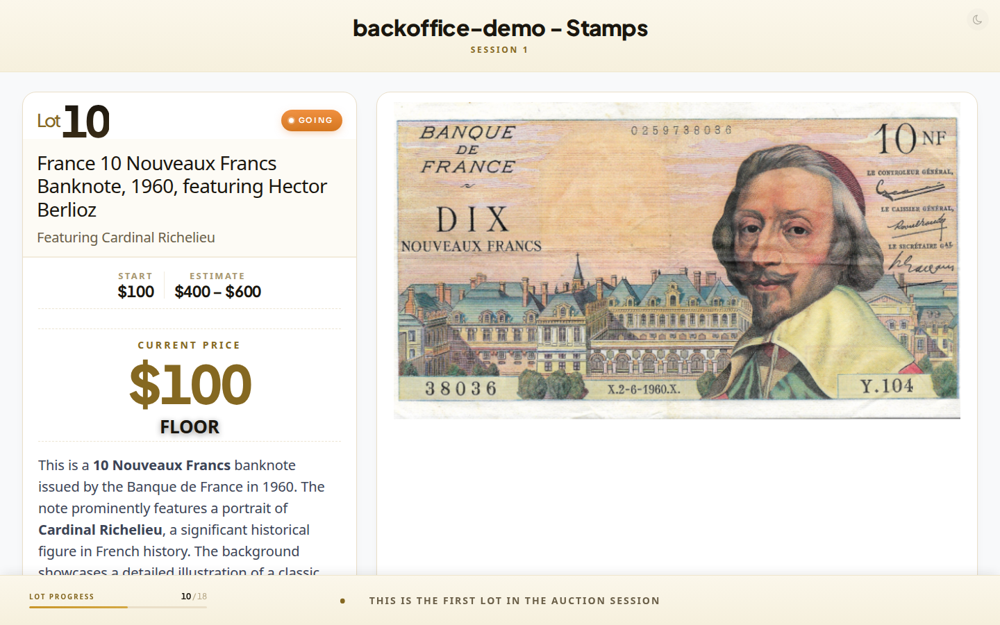 | 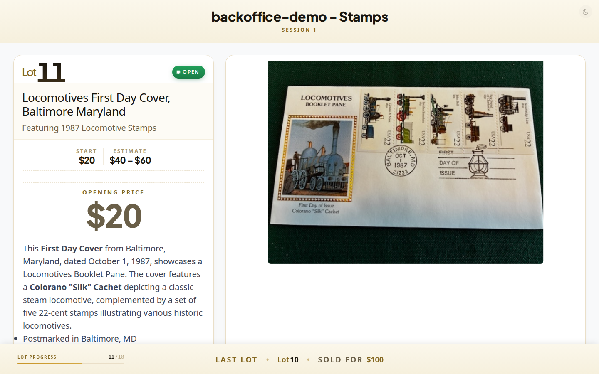 |
| **Web** | 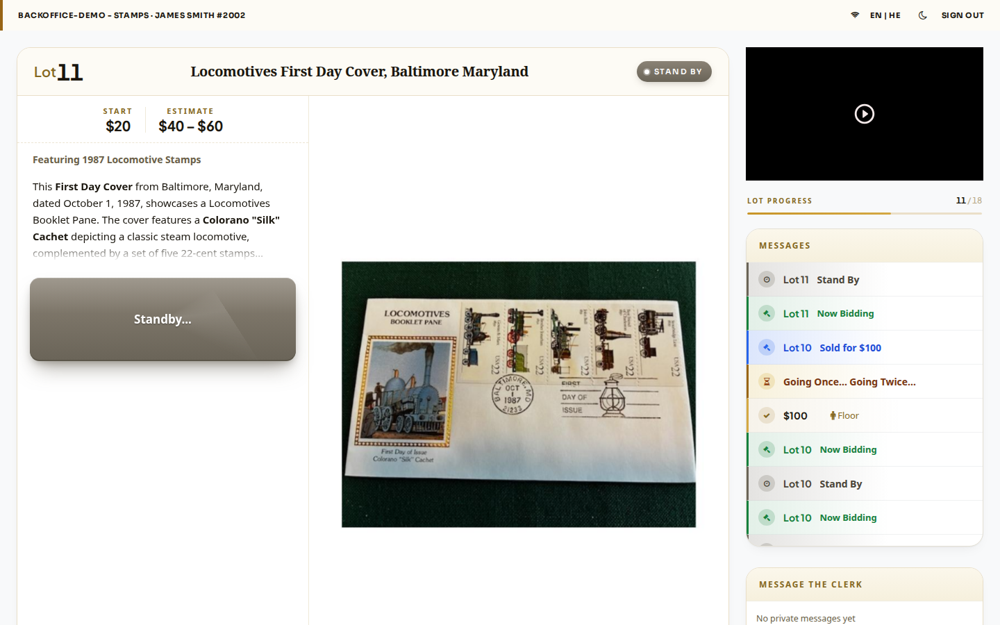 | 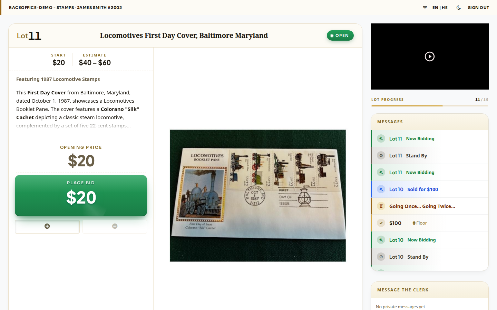 | 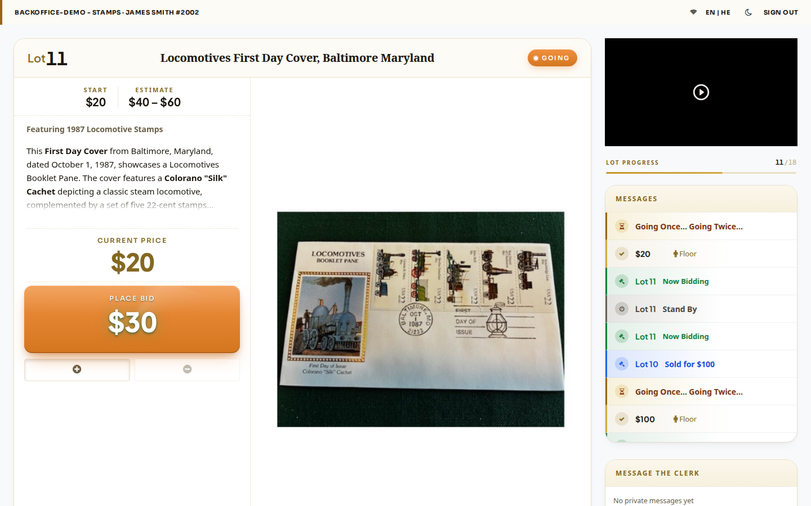 | 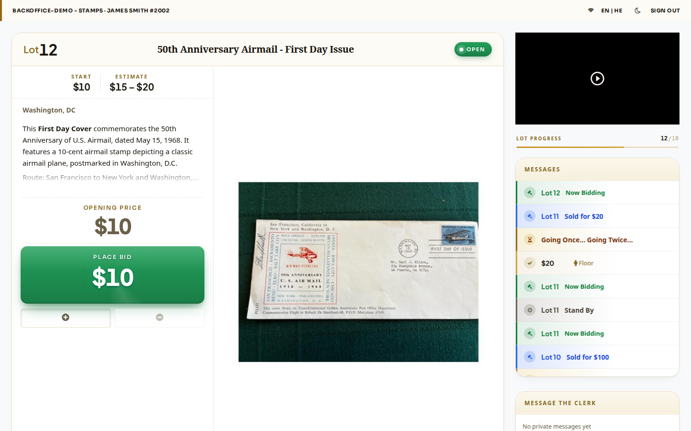 |

