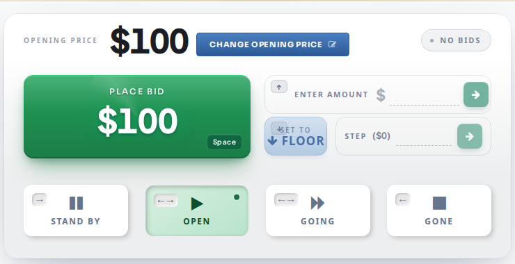
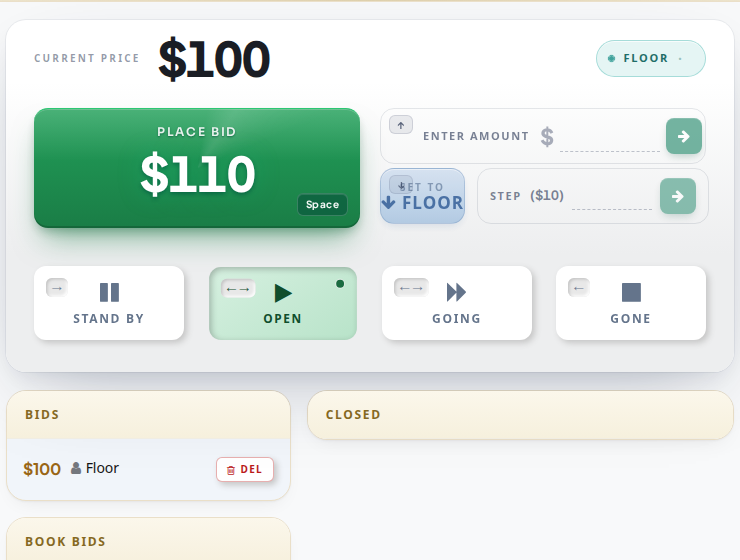
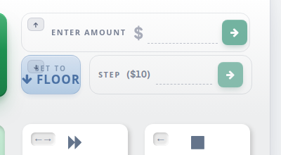

# How to Place a Bid from the Floor

Bids can be placed only when an item is marked as **Open** or **Going** \(see [Auction Flow](../auction-flow.md)\).

Bids from the web are placed automatically. Bids from the room are placed manually by the clerk.

**Placing a bid from the room**

1. Click on the **Place bid** button \(or press the **Space** key\) to place a bid on the next step. OR enter a bid value in the **Enter amount** field if you don't want to be limited by the next step. You can also change the bid **Step**.

1. Once a bid is placed \(web or room\) the current price will update and the bid will appear in the **Bids** panel.

1. If there is a conflict between a bid that was placed from the web and a bid that was placed from the floor, you can click on **Set to floor** to set the bid to the room.

