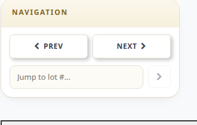

# How to Select the Bidding Item

When an item is marked as **Gone** \(see [Auction Flow](../auction-flow.md)\), the next item will display automatically. You can also select a specific item manually.

## Select the item manually

1. Use the **Prev** / **Next** buttons in the **Navigation** block to move between lots.
2. Or enter a lot number in the **Jump to lot #** field and click on the **arrow** to set the item.

