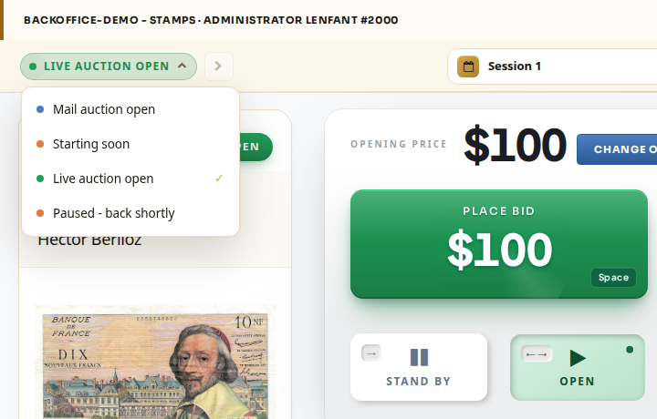

# How to Set the Auction Status

## **Set the Auction Status and Edit Message**

1. Click on the **Status** field \(top left\) and select the status, then click on the **arrow** to apply it. A relevant message will appear on the bidder's screen \(in the room and online\). See below the list of the messages.
2. For **Starting soon** and **Paused - back shortly** statuses, you can add a custom message. After applying the status, edit the message and click on **Update Paused Message**.

## **Status messages list**

| **Status** | **Message** |
| :--- | :--- |
| Closed - not started | A sale is pending |
| Mail auction open | A sale is pending |
| Starting soon | The auction will start shortly + 5 minutes break / 5 Minute Pause \(editable\) |
| Live auction open | \(display item\) |
| Paused - back shortly | Auction is paused. We will be back shortly + 5 minutes break / 5 Minute Pause \(editable\) |
| Closed - auction ended | The auction has ended. Thank you for participating. |

