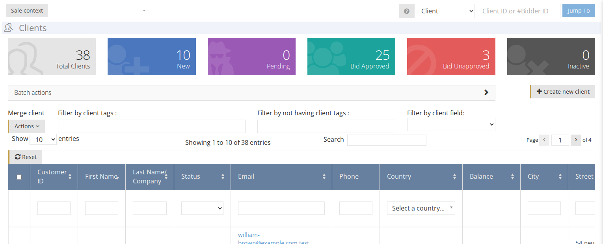

# Clients

Clients are any people who you have a business relationship with: a seller/consignor or buyer/bidder.

On the Clients dashboard you can find an overview of all clients.

The color boxes on the top **\[1\]** display the total clients and the number of clients on each status. The table **\[2\]** displays the Clients list which you can [filter](how-to-find-an-existing-client.md) by any column.

## Statuses

**New** - a new client that registered on the system or was created by admin.  
**Pending** - a client that is waiting to be approved for bidding or selling.  
**Bid Approved** - an approved client that can sell items or place bids in an auction.  
**Bid Unapproved** - a client that was not approved to participate in the auction.  
**Inactive** - a client that has been deactivated.

## Right to place a bid per status

  
**Mail** - the current price that changes according to submitted bids is exposed to the bidder.  
**Obscure mail** - the client doesn't see the current price, only the start price.

