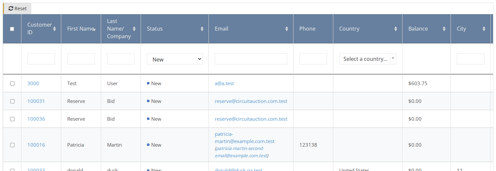
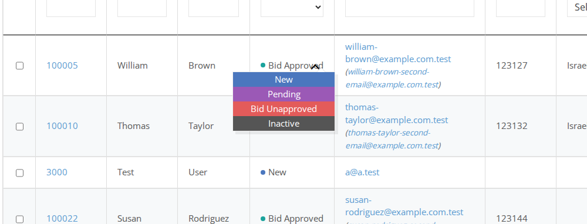
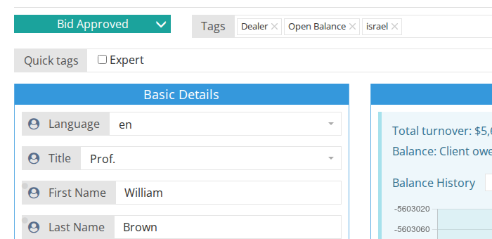
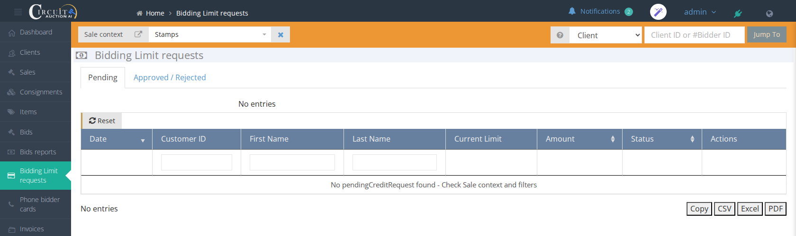

# How to Approve a Client

There are two levels of client approval:

* Approve the person as a client that can participate in auction house activities. This is done by changing the Client Status to **Bid Approved** \(see explanation below\). 
* Approve a bidding limit for a client \(bidder\) that they can use for bidding. This is done by approving Bidding Limit requests \(see explanation below\).

## Changing client status to Bid Approved

1. On the side menu go to **Clients**.
2. Filter the table by selecting the status = `Pending` or `New`. 
3. Change the status of the desired client to `Bid Approved` \(or `Bid Unapproved` if you don't want to approve this client\). 

**Note:** if you want to go over the client's data before selecting their new status, click on the Customer ID link in the table to enter the [Client Page](understanding-client-page.md), and then you can change the client status from the page itself. 

## Approving Bidding Limit requests

1. Make sure you are on the right [sale context](../sale/sale-context.md).
2. On the side menu go to **Clients**.
3. Go to the B**idding info** tab
4. On the **Bidding Limit requests** section click on **Approve**. 

**Note:** you can see all the Bidding Limit requests that are waiting for approval by clicking on **Bidding Limit requests** on the side menu.

