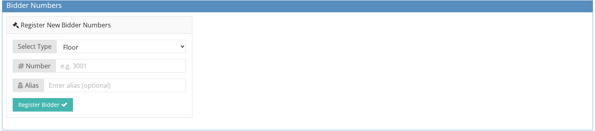
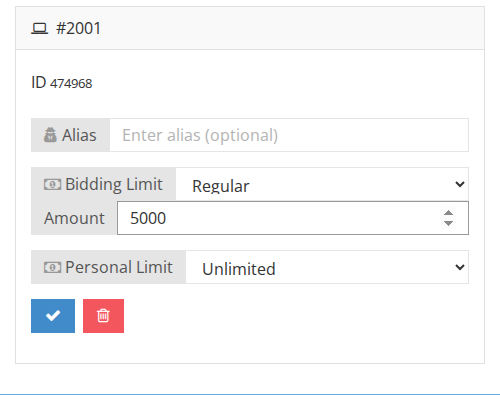
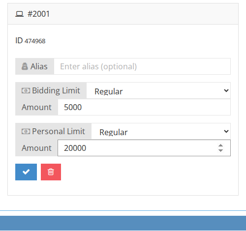
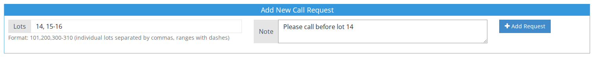

# How to Create a Bidder Number

## Creating website/mail/floor Bidder Numbers

1. Make sure you are on the right [sale context](../sale/sale-context.md).
2. Go to the Client Page \(see [How to Find an Existing Client](how-to-find-an-existing-client.md)\)
3. Go to the `Bidding info` tab.
4. Go to the `Bidder Numbers` section.
5. Select the Bidder type.
6. Enter the Bidder Number ID or leave it empty to let the system select the number.
7. click on **Save**.

1. Each bidder number will be in a separate block:

1. For Internet bids - determine the credit by choosing `regular` on the **Live credit** field, enter the amount limit and click **Save**.

1. For Internet and Mail bids you can enter the bidder limit by choosing `regular` on **Max bid** field, enter the amount limit and click **Save**. Note that the bidder may also change their limit through their My Account page.

Note that you can create multiple bidder numbers for Mail or Floor, but only one bidder number for Website or Phone.

## Creating Call Requests

1. Go to the `Call requests` section.
2. Enter the **Lots range**. Use a comma \(,\) to separate the lots numbers/ranges.

1. Enter a note if needed and click **Save**.
2. A phone bidder number will be created and added to the [Phone Bidder Cards list](how-to-download-phone-bidder-cards-list.md).

