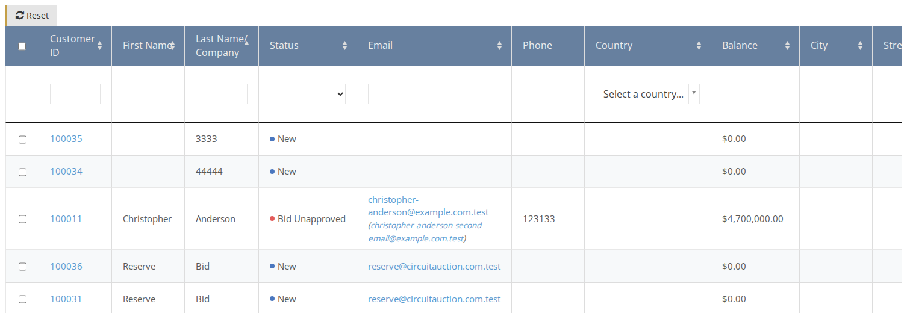
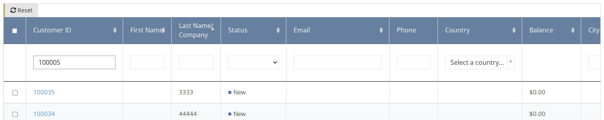
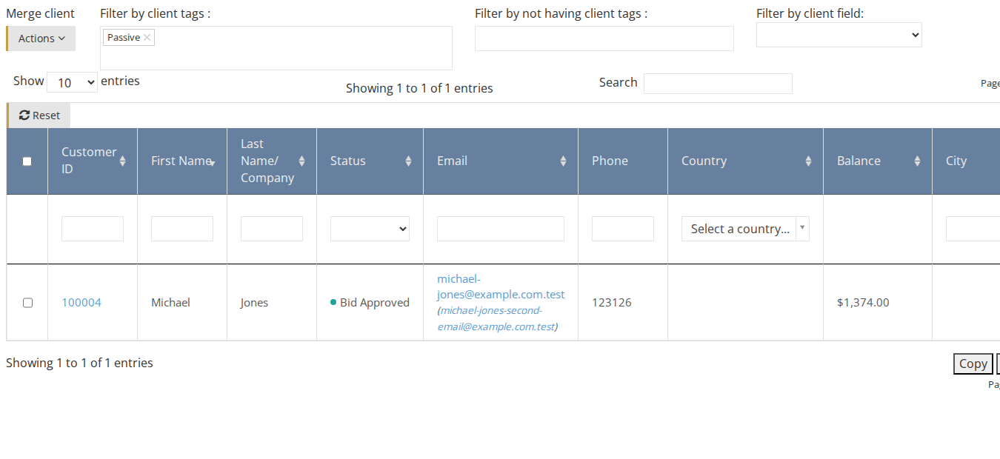

# How to Find an Existing Client

1. On the side menu go to **Clients**.
2. You have few ways to find a client in the table:

## Sorting

Click on the column header which you want to sort by.  
For example, click on the `Last Name` column header to sort the list by the clients' last names. Click again to change the order from ascending to descending and vice-versa.

## Filtering by column

On the column header enter or select the value you want to filter by. For example, enter the client ID to find a specific client or select a status in order to filter the list by that specific status.

## Filtering by Tags

Enter one or more tags to filter the list by these tags. Note that if you select more than one Tag, the table will display only clients that matched **all** the tags you have selected.

After you find the desired client, click on the Customer ID link to enter the [Client Page](understanding-client-page.md)

