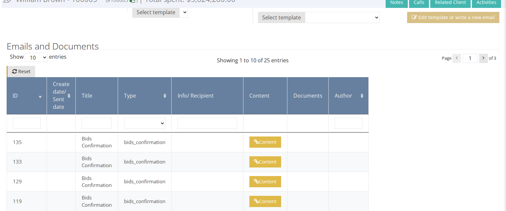

# How to Send a Bidding Report to a Client

1. Make sure you are on the right [sale context](../sale/sale-context.md).
2. Go to the Client page \(see [How to Find an Existing Client](how-to-find-an-existing-client.md)\)
3. Go to the `Emails and Documents` tab.

1. In the `Send email` block, select the email template \(for example `Bids Statement`\).
2. Click on `Edit template or write a new email` to review or adjust the content.
3. Click on `Send email`.

All the emails and documents that were sent to the client are listed in the table below \(bids confirmations appear there as `Bids Confirmation` entries\).

Note that a bids confirmation is also auto-generated and sent to the client after their last bid.

