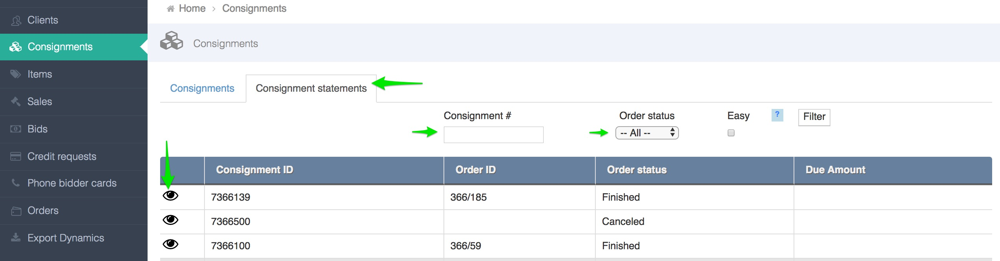

# How to create a consignment?

Best practice is to create a consignment from the consignor \(client\) page.

1. Go to the consignor page (See [how to find a client](../client/how-to-find-an-existing-client.md)).
2. Click on `+create consignment` 

3. Fill in the relevant fields  
4. Click **Save.**

You can also create consignment from the consignment dashboard. 
1. Go to **Consignment**
2. Click on `+create new consignment`

3. Fill in the relevant fields. Make sure you select the consignor \(client\) in the seller field.  
4. Click **Save.**
