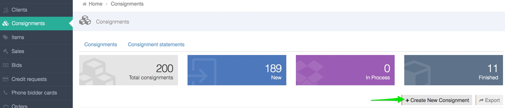

# How to create a consignment?

The best practice is to create a consignment from the consignor \(client\) page.

1. Make sure you are on the right [sale context](../sale/sale-context.md).
2. Go to the consignor page \(See [how to find a client](../client/how-to-find-an-existing-client.md)\).
3. Click on `+create consignment` 
4. Fill in the relevant fields:

**Seller** - select the client that gave you this consignment. When you create the consignment from the consignor \(client\) page this will be filled automatically.

**Underbid percentage** - if an item doesn't sold during mail or live auction, determine how much discount can be given on post sale. Check **No post sale purchase** to not allow this item to be sold after the auction.

**Tax type** - select the tax type to override the client default tax type if needed. If this field is left empty the client's tax type will be used to calculate the tax added to the invoice.

**Payment Instructions** - enter special payment instructions for the consignor \(if any\), this data will appear in the consignor order.

**Finder fees** - if this consignment was referenced to you by another client \(“Finder”\), you can add the finder name here and add the commission, in percentage, he will get from this consignment. You can add more than one finder.

**Commission steps** - If you want to override the default consignor commission \(set by the Admin on the backend\), you can add a consignment based commission step here.

* **Steps type** - determine if the calculation will be done on a single lot \(item\) basis or on the entire consignment. 
* **Commission** - percentage used to calculate the commission. \(eg. 10% 5%\)
* **From amount** - the step the consignment needs to reach to. \(eg. $1000, $5000\)  

Examples:  
_Case 1_ - In that case the commission type set to Single lots so it means every lot sold will get a 10% commision, but only lots sold over $200 will get a 7% commision.  

_Case 2_ - In that case the commission type set to Entire consignment, this means that the system will sum up all the sold lots in the consignment and add a 10% commision if the total amount is below 200. If the total is over 200 it will add a 7% commission to all lots.  

**Additional Charges** - enter additional charges tha will be added to the [consignment statement](how-consignment-statement-are-created.md).

1. Click **Save.**

You can also create consignment from the consignment dashboard. 1. Go to **Consignment** 2. Click on `+create new consignment`

1. Fill in the relevant fields. Make sure you select the consignor \(client\) in the seller field.  
2. Click **Save.**

