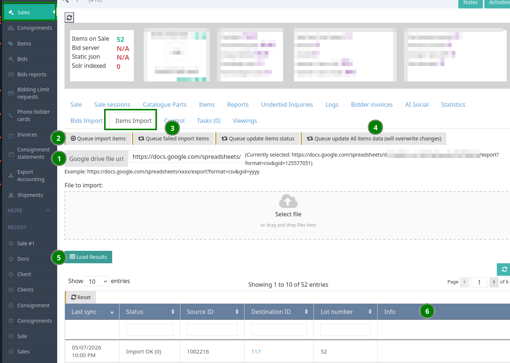

# Items (Self-Service)

Handler: `ServerItemsSelfServiceMigrate` — extends `ServerItemsDriveMigrate`.

This is the main item importer. It creates new item nodes from a CSV / Google Sheet and can auto-create the consignment and the consignor when they don't already exist.

**Example Sheet:** [https://docs.google.com/spreadsheets/d/13OhdvytrpmdOLLAUoC2mRi7jTs6lzKCccyNDqus8lgo/edit#gid=219859970](https://docs.google.com/spreadsheets/d/13OhdvytrpmdOLLAUoC2mRi7jTs6lzKCccyNDqus8lgo/edit#gid=219859970)

## Step-by-Step Instructions



1. To create the consignment automatically while importing, the `_consignment` field must include the 3 parameters in this format:

   ```
   <email>|<consignment number>|<consignment name>
   ```

2. The easiest workflow is to work with a Google Sheet, so you can make changes and reimport if any row fails due to missing data.

   Paste the published CSV export URL of the sheet in the **Google drive file URL** textbox (see **1**). For example:

   ```
   https://docs.google.com/spreadsheets/d/<SPREADSHEET_ID>/export?format=csv&gid=<SHEET_GID>
   ```

   The corresponding edit URL (origin) looks like:

   ```
   https://docs.google.com/spreadsheets/d/<SPREADSHEET_ID>/edit?gid=<SHEET_GID>#gid=<SHEET_GID>
   ```

3. Click **Queue import items** (see **2**) to start the import.

   
   This function will only attempt to import items that were never imported before. It is safe to use for the first import on the document, or to add new items without overriding items that have already been imported.
   

4. After the import is done, click **Load Results** (see **5**) to display the import result table.

5. If some items could not be imported, the reason will appear in the **Info** column (see **6**).

6. For failed imports, click **Queue failed import items** (see **3**) to retry only the rows that failed.

7. To reimport everything and overwrite previous items, click **Queue update All items data (will overwrite changes)** (see **4**).

   
   This option will override any change made manually on items in the back-office. Use it carefully.
   

## Required Fields

* **`_unique_id`** - Unique identifier for each row (required for tracking)

## Consignment & Sale Fields

* **`_consignment`** - Supports multiple formats:
  * `<seller email>|<consignment ID>|<consignment name>`
  * `<customer ID>` (numeric)
  * `nid:<node_id>` (consignor node ID)
  * `<email address>` (consignor email)


If no consignment is found, a new consignment will be created automatically. The system will:
1. Search for consignor by customer ID, email, or NID
2. Auto-create consignor if not found (requires consignor_email and consignor_last_name or consignor_full_name)
3. Create consignment linked to the sale and consignor


* **`_sale`** - Sale node ID (required, injected automatically from the form's `sale_nid` argument)
* **`_sale_number`** - Alternative: Sale number if `_sale` is not provided

## Lot Information

* **`_lot_number`** - Lot number
* **`_lot_letter`** - Lot letter
* **`_temp_lot_number`** - Temporary lot number
* **`_internal_id`** - Internal item ID
* **`_position_of_consignment`** - Position within the consignment

## Content Fields (Multi-language Support)

Replace `{language}` with language code (e.g., `en`, `he`):

* **`_title_{language}`** - Item title
* **`_item_subtitle_{language}`** - Item subtitle
* **`_body_{language}`** - Item description (HTML supported, will be cleaned)
* **`_footer_{language}`** - Footer text (HTML supported, will be cleaned)
* **`_provenance_{language}`** - Provenance information (HTML supported, will be cleaned)

Example: `_title_en`, `_title_he`, `_body_en`, `_body_he`

## Pricing Fields

* **`_opening_price`** - Opening bid price
* **`_minimum_price`** - Reserve/minimum price
* **`_estimation_low`** - Low estimate
* **`_estimation_high`** - High estimate
* **`_buy_now_price`** - Buy now price
* **`_buy_now_setting`** - Buy now setting


Currency symbols will be automatically removed and numbers converted to proper float format.


## Category Fields

* **`_main_category`** - Main category name (pipe-separated for multiple)
* **`_main_category_{language}`** - Main category in second language
* **`_sub_category`** - Sub category (child of main category)
* **`_sub_category_{language}`** - Sub category in second language
* **`_extra_category`** - Extra category (child of sub category)
* **`_extra_category_{language}`** - Extra category in second language
* **`_main_category_id`** - Philaworksplace category ID


Categories support hierarchical structure: Main > Sub > Extra. Terms are auto-created if they don't exist.


## Catalog Fields

Supports up to 2 catalogs per item:

**First Catalog:**
* **`_catalog_name`** - Catalog name (e.g., "Scott", "Stanley Gibbons")
* **`_catalog_number`** - Catalog number
* **`_catalog_number_value`** - Catalog value/price

**Second Catalog:**
* **`_catalog_name_2`** - Second catalog name
* **`_catalog_number_2`** - Second catalog number
* **`_catalog_number_value_2`** - Second catalog value/price

**Catalog Part:**
* **`_catalog_part`** - Catalog part/section

## Philatelic Symbols

* **`_symbols`** - Philatelic symbols (pipe-separated)
  * Supports special notation:
    * `**` → Mint
    * `*` → Unused
    * `o` or `O` → Used
    * `(*)` → Without gum
  * Or use text names directly (e.g., "Mint|Used")
* **`_sub_symbol`** - Sub symbol

## Physical Properties

* **`_year`** - Year
* **`_country`** - Country
* **`_mediums`** - Mediums (pipe-separated for multiple values)
* **`_grade`** - Grade/condition
* **`_thematics`** - Thematic categories

## Dimensions

**Individual Dimensions:**
* **`_height`** - Height
* **`_width`** - Width
* **`_depth`** - Depth
* **`_size_description`** - Description of dimensions

**Combined Dimensions:**
* **`_size`** - Format: "H x W x D unit" (e.g., "35.75 x 26.75 x 1.25 in")
* **`_framed`** - Framed dimensions (same format as `_size`)
* **`_quantity`** - Number of items (creates multiple dimension records)


Units default to inches (in). System automatically creates dimension nodes and parses combined dimension formats.


## Links & Certificates

**Certificate:**
* **`_certificate_link`** - Certificate URL
* **`_certificate_link_title`** - Certificate link title

**References:**
* **`_reference_link1`** - First reference URL
* **`_reference_link_title1`** - First reference link title
* **`_reference_link2`** - Second reference URL
* **`_reference_link_title2`** - Second reference link title

## Item Settings

* **`_item_type`** - Item type (defaults to "single")
* **`_field_item_status`** - Item status (defaults to "ready")
* **`_collectible_type`** - Collectible type:
  * `Artwork` → converted to `fine_art`
  * `Book` → converted to `books`
  * Or use direct values: `stamps`, `coins`, etc.
* **`_language`** - Language code (defaults to site default)

## Additional Information

* **`_auctioneer_notes`** - Internal auctioneer notes
* **`_search_tag`** - Search tags for better discoverability
* **`_public_message`** - Public message visible to bidders
* **`_post_sale_purchase`** - Post-sale purchase flag
* **`_responsible_user`** - Responsible user (username or full name)

## Commission

* **`_consignor_commission`** - Consignor commission percentage
* **`_commission`** - Commission for the consignment (converted from decimal to percentage if < 1)

## Consignor Auto-Creation Fields

When consignor doesn't exist, these fields enable auto-creation:

* **`consignor_email`** - Consignor email address
* **`consignor_first_name`** - First name
* **`consignor_last_name`** - Last name
* **`consignor_full_name`** - Full name (will be split into first/last)


In non-live environments, ".test" is appended to emails to prevent sending to real clients.


## Notes (Self-Service Only)

`ServerItemsSelfServiceMigrate` also imports up to four free-form note columns and creates `note` nodes attached to the item:

* **`_notes`**, **`_notes2`**, **`_notes3`**, **`_notes4`** - Pipe-separated note strings. Each pipe segment becomes a separate note node. Titles are stable so re-imports do not create duplicates.

## Sold Items (Creates Winning Bid)

When `_sold_for` is provided, the system automatically creates an item history task to record the winning bid:

* **`_sold_for`** - Sold price (triggers automatic item history task creation)
  * If `0`, item status is set to UNSOLD
  * If empty, no task is created
  * If > 0, item status is set to SOLD

**Winning Bidder Information:**
* **`_winning_user`** - Winning user internal ID (if migrate mapping enabled)
* **`_winning_user_nid`** - Winning user node ID
* **`_bidder_number`** - Bidder number for the sale

**Optional Client Information (for winner):**
* **`_first_name`** - Winner's first name
* **`_last_name`** - Winner's last name
* **`_phone`** - Winner's phone number
* **`_email`** - Winner's email address


**Item History Queue Task:**
The system queues a task (SERVER_ITEM_HISTORY_QUEUE_IMPORT_RESULT) that:
- Creates the winning bid record
- Links the item to the winning bidder
- Records the sold price and status
- Allows empty bidder (auto-creates if needed)
- Uses lot_number and lot_letter ('-' default) to identify the item


## Processing Logic

1. **Consignment Resolution:**
   * Searches by customer ID → NID → email → consignment ID → consignment name
   * Auto-creates consignor if email and name provided
   * Auto-creates consignment if consignor found but no matching consignment

2. **Price Conversion:**
   * Removes currency symbols automatically
   * Converts to proper float format

3. **Category Hierarchy:**
   * Creates multi-level taxonomy: Main → Sub → Extra
   * Supports multi-language term names
   * Auto-creates missing terms

4. **Dimension Nodes:**
   * Creates separate dimension node entities
   * Supports multiple instances based on `_quantity`
   * Parses combined dimension strings automatically

5. **HTML Cleaning:**
   * Body, provenance, and footer fields are cleaned of unsafe HTML

6. **Symbol Mapping:**
   * Converts philatelic shorthand to full term names
   * Creates terms if they don't exist in symbols vocabulary
