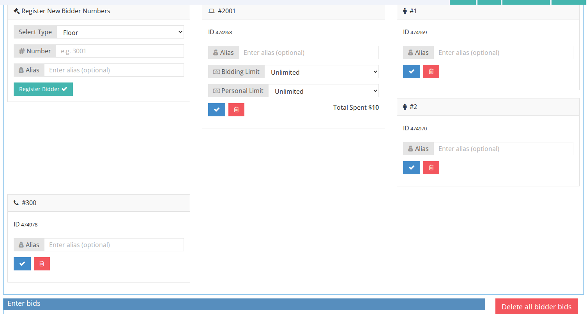
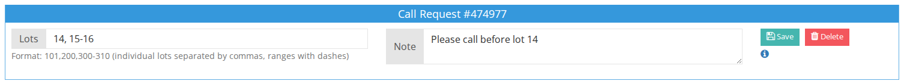
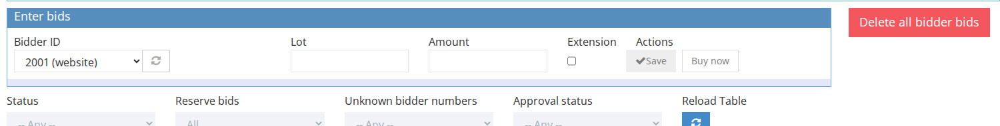

<!-- i18n source=bids/bidding-info-tab.md sha=3ce70707b365 -->
# Tab Gebotsinformationen

Der Tab **Gebotsinformationen** auf der Kundenseite bietet eine vollständige Übersicht über die Gebotsaktivitäten eines Kunden und die zugehörigen Einstellungen für die aktuelle Auktion.

## Bieternummern

- Bieternummern des aktuellen Kunden anzeigen und hinzufügen
- Zeigt je Bieternummer die Gesamtausgaben sowie das maximal zulässige Credit Limit bzw. Gebot an

## Kreditanfragen und Telefonbieteranfragen

### Kreditanfragen

- Kunden können Kreditanfragen zur Genehmigung durch Mitarbeiter senden
- Das genehmigte Limit bestimmt den maximalen Betrag, den der Kunde gewinnen kann

### Telefonbieteranfragen

- Geben Sie einen Bereich oder bestimmte Lose für die Telefonbieterliste eines Kunden ein
- Mitarbeiter können den Anfragen Notizen hinzufügen
- Telefonbieteranfragen können von der entsprechenden Seite gedruckt werden

## Gebote eingeben und alle Gebote eines Kunden löschen

- Gebote nur für den aktuellen Kunden eingeben (über die Auswahlliste der Bieternummer)
- Option, **alle** Gebote des Kunden in der Auktion zu löschen (erfordert eine Bestätigung)

## Tabelle der Lose mit Geboten

- Zeigt die Gebote des aktuellen Kunden an, auch wenn er nicht der Höchstbietende ist
- Ein grüner Hintergrund hebt Zeilen hervor, in denen der Kunde der Höchstbietende ist
- Die Navigation im Popup ist auf Lose beschränkt, auf die der Kunde Gebote abgegeben hat

