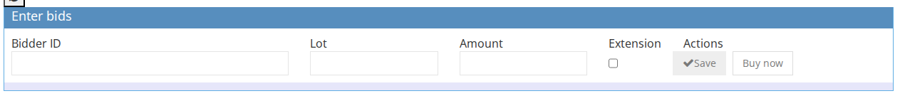

<!-- i18n source=client/how-to-place-a-bid-for-a-client.md sha=6e1e8e096039 -->
# So geben Sie ein Gebot für einen Kunden ab

Sie können ein schriftliches Gebot für einen Kunden über die Kundenseite oder die Seite „Gebote“ abgeben.

## Gebot über die Kundenseite abgeben

1. Stellen Sie sicher, dass Sie sich im richtigen [Auktionskontext](../sale/sale-context.md) befinden.
2. Öffnen Sie die Kundenseite \(siehe [So finden Sie einen vorhandenen Kunden](how-to-find-an-existing-client.md)\)
3. Wechseln Sie zum Tab `Gebotsinformationen`.
4. Gehen Sie zum Bereich `Gebote eingeben`.
5. Wählen Sie die **Bidder ID**, geben Sie die Losnummer des Loses im Feld **Los** und den Betrag im Feld **Menge** ein. Markieren Sie das Feld **Extension**, wenn der Bieter verlangt, dass das Los von einem Experten bestätigt wird.
6. Klicken Sie auf **speichern**.

## Gebot über die Seite „Gebote“ abgeben

1. Stellen Sie sicher, dass Sie sich im richtigen [Auktionskontext](../sale/sale-context.md) befinden.
2. Gehen Sie im Seitenmenü zu **Gebote**
3. Wählen Sie die **Bidder ID**, geben Sie die Losnummer des Loses im Feld **Los** und den Betrag im Feld **Menge** ein. Markieren Sie das Feld **Extension**, wenn der Bieter verlangt, dass das Los von einem Experten bestätigt wird.
4. Klicken Sie auf **speichern**.

