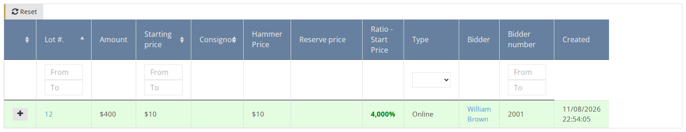
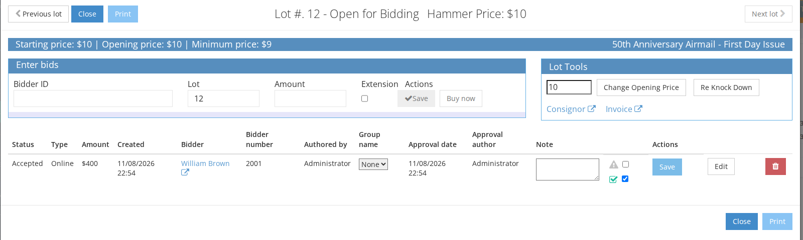
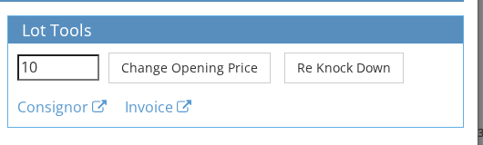
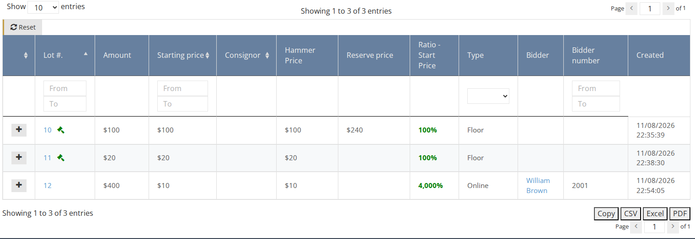

<!-- i18n source=client/how-to-view-clients-bids.md sha=9d3ea462c2b0 -->
# So sehen Sie die Gebote eines Kunden ein

Sie können die Gebote eines Kunden auf der Kundenseite oder auf der Seite „Gebote“ einsehen.

## Auf der Kundenseite

1. Stellen Sie sicher, dass Sie sich im richtigen [Auktionskontext](../sale/sale-context.md) befinden.
2. Öffnen Sie die Kundenseite \(siehe [So finden Sie einen vorhandenen Kunden](how-to-find-an-existing-client.md)\)
3. Wechseln Sie zum Tab `Gebotsinformationen`.
4. Am Ende der Seite finden Sie eine Liste der Gebote des Kunden, sortiert nach Losnummern:

1. Verwenden Sie die Filter, um nach bestimmten Daten zu suchen:

1. Klicken Sie auf das Symbol `+`, um alle Gebote für dieses Los zu sehen. Mit den Aktionsschaltflächen können Sie jedes Gebot ändern oder löschen:

1. Verwenden Sie den Block `Lot Tools`, um den Ausruf zu ändern und erneut zuzuschlagen:

## Auf der Seite „Gebote“

1. Stellen Sie sicher, dass Sie sich im richtigen [Auktionskontext](../sale/sale-context.md) befinden.
2. Gehen Sie im Seitenmenü zu **Gebote**.
3. Hier finden Sie eine Liste der Gebote aller Kunden, sortiert nach Losnummern. Sie können dieselben Aktionen ausführen wie auf der Kundenseite.

