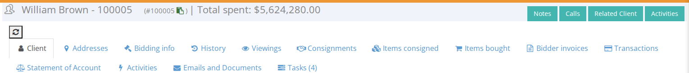

<!-- i18n source=client/understanding-client-page.md sha=04f5aa318a7b -->
# Die Kundenseite verstehen

Oben auf der Seite finden Sie mehrere Tabs, die unten beschrieben sind.

## Kunde

Informationen zum Kunden, gegliedert in Bereiche: Grunddaten wie Name und Kontaktdaten, Finanzinformationen, Auktionsinformationen \(zum Beispiel, ob es eine Warnung zu diesem Kunden gibt\), Versandpräferenzen und Zugang zur Webseite.

Am Ende des Tabs „Kunde“ finden Sie eine Liste der Inhaltsversionen und den Namen des Benutzers, der die Änderung vorgenommen hat.

## Adressen

Die Adressen des Kunden \(Standard-, Rechnungs- und Lieferadresse\).

## Gebotsinformationen

Unter diesem Tab stehen Ihnen mehrere Aktionen zur Verfügung:

* [Bieternummer\(n\)](/de/client/how-to-create-bidder-number.md) für diesen Kunden registrieren.
* Eine Liste der [Gebote des Kunden](/de/client/how-to-view-clients-bids.md) in der [aktuellen Auktion](/de/sale/sale-context.md) ansehen.
* Ein [neues Gebot](/de/client/how-to-place-a-bid-for-a-client.md) für diesen Kunden abgeben.
* Anfragen des Kunden für das Credit Limit genehmigen und Rückrufanfragen \(Call requests\) hinzufügen.

## Historie

Die Gebotshistorie des Kunden in vergangenen Auktionen.

## Viewings

Besichtigungstermine für diesen Kunden.

## Einlieferungen

Liste der [Einlieferungen](../consignment/) des Kunden. Dies ist nur für Kunden relevant, die Einlieferer sind.

## Items consigned

Liste der Lose, die der Kunde eingeliefert hat. Dies ist nur für Kunden relevant, die Einlieferer sind.

## Items bought

Liste der Lose, die der Kunde gekauft hat. Dies ist nur für Kunden relevant, die Bieter sind.

## Auktionsfaktura

Liste der Bieterrechnungen des Kunden.

## Vorgänge

Die Finanzvorgänge des Kunden.

## Kontoauszug

Eine Zusammenfassung des Kontostands des Kunden.

## Aktivitäten

Das Aktivitätsprotokoll für diesen Kunden.

## Emails and Documents

Hier können Sie Dokumente aus Vorlagen erstellen, E-Mails senden \(zum Beispiel einen [Gebotsbericht](/de/client/how-to-send-a-bidding-report-to-a-client.md)\) und alles einsehen, was an den Kunden gesendet wurde.

## Aufgaben

[Aufgaben](/de/tasks.md) zu diesem Kunden.
