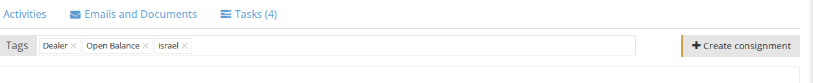
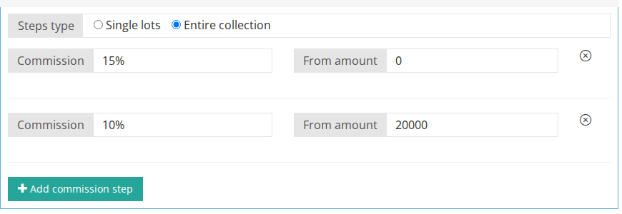
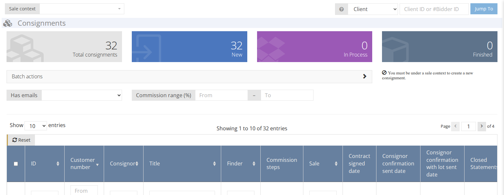

<!-- i18n source=consignment/how-to-create-a-consignment.md sha=4ce0d9123b61 -->
# So legen Sie eine Einlieferung an

Am besten legen Sie eine Einlieferung von der Seite des Einlieferers \(Kunden\) aus an.

1. Stellen Sie sicher, dass Sie sich im richtigen [Auktionskontext](../sale/sale-context.md) befinden.
2. Öffnen Sie die Seite des Einlieferers \(siehe [So finden Sie einen vorhandenen Kunden](../client/how-to-find-an-existing-client.md)\).
3. Klicken Sie auf `Einlieferung anlegen` 
4. Füllen Sie die relevanten Felder aus:

**Einlieferer** - Wählen Sie den Kunden aus, der Ihnen diese Einlieferung übergeben hat. Wenn Sie die Einlieferung von der Seite des Einlieferers \(Kunden\) aus anlegen, wird dies automatisch ausgefüllt.

**Untergebot (Prozent)** - Legen Sie fest, wie viel Nachlass bei einem Nachverkauf gewährt wird, wenn ein Los während der schriftlichen oder der Live-Auktion nicht verkauft wurde. Aktivieren Sie **Nachverkauf gesperrt**, um den Verkauf dieses Loses nach der Auktion nicht zuzulassen.

**Steuerart** - Wählen Sie eine Steuerart, um bei Bedarf die Standard-Steuerart des Kunden zu überschreiben. Bleibt dieses Feld leer, wird die Steuerart des Kunden zur Berechnung der auf der Rechnung ausgewiesenen Steuer verwendet.

**Zahlungsanweisungen** - Geben Sie ggf. besondere Zahlungsanweisungen für den Einlieferer ein. Diese Angaben erscheinen in der Einliefererabrechnung.

**Vermittlungsprovision** - Wenn diese Einlieferung durch einen anderen Kunden vermittelt wurde („Finder“), können Sie hier den Namen des Vermittlers hinzufügen sowie die Provision in Prozent, die er für diese Einlieferung erhält. Sie können mehr als einen Vermittler hinzufügen.

**Provisionsschritte** - Wenn Sie die Standardprovision für Einlieferer \(vom Administrator im Backend festgelegt\) überschreiben möchten, können Sie hier eine einlieferungsbezogene Provisionsstufe hinzufügen.

* **Typ der Stufen** - Legen Sie fest, ob die Berechnung auf Basis einzelner Lose oder der gesamten Einlieferung erfolgt. 
* **Provision** - Prozentsatz zur Berechnung der Provision. \(z. B. 10 % 5 %\)
* **von Betrag** - Die Stufe, die die Einlieferung erreichen muss. \(z. B. 1.000 $, 5.000 $\)  

Beispiele:  
_Fall 1_ - Hier ist der Typ der Provisionsstufen auf Einzellose gesetzt. Dadurch erhalten alle Lose, die unter 200 $ verkauft werden, 10 % Provision. Alle Lose, die für 200 $ und mehr verkauft werden, erhalten 7 % Provision.  

_Fall 2_ - Hier ist der Typ der Provisionsstufen auf die gesamte Einlieferung gesetzt. Wenn die gesamte Sammlung von Losen für weniger als 200 $ verkauft wird, erhält sie 10 % Provision. Wenn die gesamte Sammlung von Losen zusammen für 200 $ oder mehr verkauft wird, erhält sie 7 % Provision.  

**zusätzliche Kosten** - Geben Sie zusätzliche Kosten ein, die der [Einlieferungsabrechnung](how-consignment-statement-are-created.md) hinzugefügt werden.

1. Klicken Sie auf **speichern.**

Sie können eine Einlieferung auch im Einlieferungs-Dashboard anlegen. 1. Gehen Sie zu **Einlieferung** 2. Klicken Sie auf `Einlieferung anlegen`

1. Füllen Sie die relevanten Felder aus. Stellen Sie sicher, dass Sie den Einlieferer \(Kunden\) im Feld „Einlieferer“ auswählen.  
2. Klicken Sie auf **speichern.**
