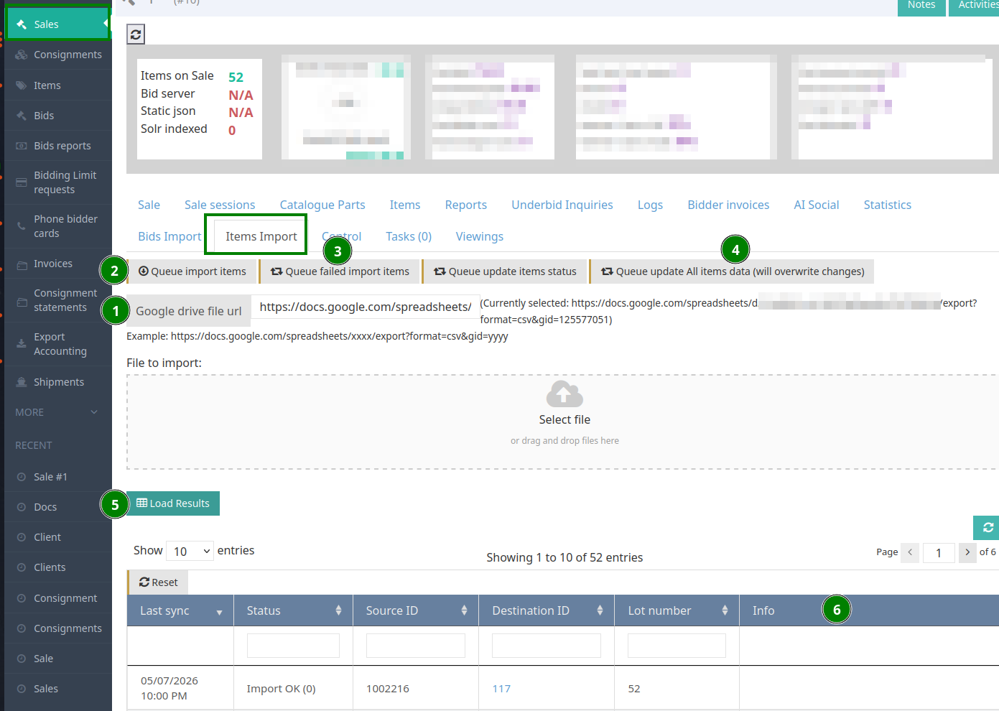

<!-- i18n source=data-migration/items.md sha=ee87179cd02a -->
---
description: Massenimport von Losen aus einem Google Sheet (ServerItemsSelfServiceMigrate).
---

# Lose (Self-Service)

Handler: `ServerItemsSelfServiceMigrate` — erweitert `ServerItemsDriveMigrate`.

Dies ist der wichtigste Importer für Lose. Er erstellt neue Losknoten aus einer CSV / einem Google Sheet und kann Einlieferung und Einlieferer automatisch anlegen, wenn sie noch nicht existieren.

**Beispiel-Sheet:** [https://docs.google.com/spreadsheets/d/13OhdvytrpmdOLLAUoC2mRi7jTs6lzKCccyNDqus8lgo/edit#gid=219859970](https://docs.google.com/spreadsheets/d/13OhdvytrpmdOLLAUoC2mRi7jTs6lzKCccyNDqus8lgo/edit#gid=219859970)

## Schritt-für-Schritt-Anleitung



1. Damit die Einlieferung beim Import automatisch erstellt wird, muss das Feld `_consignment` die 3 Parameter in diesem Format enthalten:

   ```
   <email>|<consignment number>|<consignment name>
   ```

2. Am einfachsten arbeiten Sie mit einem Google Sheet, so können Sie Änderungen vornehmen und erneut importieren, wenn eine Zeile wegen fehlender Daten fehlschlägt.

   Fügen Sie die URL des Sheets in das Textfeld **Google drive file URL** ein (siehe **1**). Sie können den normalen `edit`-Link direkt aus dem Browser einfügen — das Backoffice wandelt ihn automatisch in die CSV-Exportform um:

   ```
   https://docs.google.com/spreadsheets/d/<SPREADSHEET_ID>/export?format=csv&gid=<SHEET_GID>
   ```

   Die zugehörige Bearbeiten-URL (Ursprung) sieht so aus:

   ```
   https://docs.google.com/spreadsheets/d/<SPREADSHEET_ID>/edit?gid=<SHEET_GID>#gid=<SHEET_GID>
   ```

   Neben dem Textfeld erscheint ein Link **Tabelle öffnen**, sobald eine gültige Sheet-URL eingegeben ist; er führt Sie zurück zum bearbeitbaren Google Sheet.

   
   Die Seite **Item Import** hat Reiter für die verwandten Importe pro Auktion, die diesen Ablauf teilen: **Items** (diese Seite), [Los-Kataloge](items-catalogs.md), [Los-Dimensionen](items-dimensions.md) und [Zuschlagsergebnisse der Lose](items-sold-result.md). Jeder Reiter hat sein eigenes Eingabefeld für URL / Datei, eigene Warteschlangen-Buttons und eine eigene Ergebnistabelle sowie einen Link **Help** zu seiner Seite in dieser Dokumentation.
   

3. Klicken Sie auf **Importelemente in die Warteschlange stellen** (siehe **2**), um den Import zu starten.

   
   Diese Funktion versucht nur, Lose zu importieren, die noch nie importiert wurden. Sie eignet sich sicher für den ersten Import des Dokuments oder um neue Lose hinzuzufügen, ohne bereits importierte Lose zu überschreiben.
   

4. Klicken Sie nach Abschluss des Imports auf **Load Results** (siehe **5**), um die Ergebnistabelle des Imports anzuzeigen.

5. Konnten einige Lose nicht importiert werden, erscheint der Grund in der Spalte **Info** (siehe **6**).

6. Klicken Sie bei fehlgeschlagenen Importen auf **Queue failed import items** (siehe **3**), um nur die fehlgeschlagenen Zeilen zu wiederholen.

7. Um alles erneut zu importieren und frühere Lose zu überschreiben, klicken Sie auf **Queue update All items data (will overwrite changes)** (siehe **4**).

   
   Diese Option überschreibt jede manuelle Änderung an Losen im Backoffice. Verwenden Sie sie mit Bedacht.
   

## Pflichtfelder

* **`_unique_id`** - Eindeutige Kennung für jede Zeile (zur Nachverfolgung erforderlich)

## Felder zu Einlieferung & Auktion

* **`_consignment`** - Unterstützt mehrere Formate:
  * `<seller email>|<consignment ID>|<consignment name>`
  * `<customer ID>` (numerisch)
  * `nid:<node_id>` (Knoten-ID des Einlieferers)
  * `<email address>` (E-Mail-Adresse des Einlieferers)


Wird keine Einlieferung gefunden, wird automatisch eine neue Einlieferung erstellt. Das System geht dabei wie folgt vor:
1. Es sucht den Einlieferer über Kunden-ID, E-Mail-Adresse oder NID
2. Es legt den Einlieferer automatisch an, wenn er nicht gefunden wird (erfordert consignor_email und consignor_last_name oder consignor_full_name)
3. Es erstellt die Einlieferung, verknüpft mit der Auktion und dem Einlieferer


* **`_sale`** - Knoten-ID der Auktion (erforderlich, wird automatisch aus dem Formularargument `sale_nid` eingefügt)
* **`_sale_number`** - Alternative: Auktionsnummer, wenn `_sale` nicht angegeben ist

## Losinformationen

* **`_lot_number`** - Losnummer
* **`_lot_letter`** - Losnummernzusatz
* **`_temp_lot_number`** - Vorläufige Losnummer
* **`_internal_id`** - Interne Los-ID
* **`_position_of_consignment`** - Position innerhalb der Einlieferung

## Inhaltsfelder (mehrsprachig)

Ersetzen Sie `{language}` durch den Sprachcode (z. B. `en`, `he`):

* **`_title_{language}`** - Titel des Loses
* **`_item_subtitle_{language}`** - Untertitel des Loses
* **`_body_{language}`** - Beschreibung des Loses (HTML wird unterstützt und bereinigt)
* **`_footer_{language}`** - Fußtext (HTML wird unterstützt und bereinigt)
* **`_provenance_{language}`** - Provenienzangaben (HTML wird unterstützt und bereinigt)

Beispiel: `_title_en`, `_title_he`, `_body_en`, `_body_he`

## Preisfelder

* **`_opening_price`** - Ausrufpreis
* **`_minimum_price`** - Limit / Mindestpreis
* **`_estimation_low`** - Untere Schätzung
* **`_estimation_high`** - Obere Schätzung
* **`_buy_now_price`** - Sofortkaufpreis
* **`_buy_now_setting`** - Einstellung für Sofortkauf


Währungssymbole werden automatisch entfernt und Zahlen in das passende Gleitkommaformat umgewandelt.


## Kategoriefelder

* **`_main_category`** - Name der Hauptkategorie (bei mehreren durch Pipe getrennt)
* **`_main_category_{language}`** - Hauptkategorie in der zweiten Sprache
* **`_sub_category`** - Unterkategorie (Kind der Hauptkategorie)
* **`_sub_category_{language}`** - Unterkategorie in der zweiten Sprache
* **`_extra_category`** - Zusatzkategorie (Kind der Unterkategorie)
* **`_extra_category_{language}`** - Zusatzkategorie in der zweiten Sprache
* **`_main_category_id`** - Philaworksplace-Kategorie-ID


Kategorien unterstützen eine hierarchische Struktur: Haupt > Unter > Zusatz. Terme werden automatisch angelegt, wenn sie nicht existieren.


## Katalogfelder

Unterstützt bis zu 2 Kataloge pro Los:

**Erster Katalog:**
* **`_catalog_name`** - Katalogname (z. B. „Scott“, „Stanley Gibbons“)
* **`_catalog_number`** - Katalognummer
* **`_catalog_number_value`** - Katalogwert / -preis

**Zweiter Katalog:**
* **`_catalog_name_2`** - Name des zweiten Katalogs
* **`_catalog_number_2`** - Nummer des zweiten Katalogs
* **`_catalog_number_value_2`** - Wert / Preis des zweiten Katalogs

**Katalogteil:**
* **`_catalog_part`** - Katalogteil / Abschnitt

## Philatelistische Symbole

* **`_symbols`** - Philatelistische Symbole (durch Pipe getrennt)
  * Unterstützt eine Kurzschreibweise:
    * `**` → Mint
    * `*` → Unused
    * `o` oder `O` → Used
    * `(*)` → Without gum
  * Oder verwenden Sie die Textnamen direkt (z. B. „Mint|Used“)
* **`_sub_symbol`** - Untersymbol

## Physische Eigenschaften

* **`_year`** - Jahr
* **`_country`** - Land
* **`_mediums`** - Materialien (bei mehreren Werten durch Pipe getrennt)
* **`_grade`** - Zustand / Erhaltung
* **`_thematics`** - Thematische Kategorien

## Dimensionen

**Einzelne Maße:**
* **`_height`** - Höhe
* **`_width`** - Breite
* **`_depth`** - Tiefe
* **`_units`** - Einheiten der Maße (`cm`, `mm`, `m` oder `in`); optional
* **`_size_description`** - Beschreibung der Maße

**Kombinierte Maße:**
* **`_size`** - Format: „H x W x D unit“ (z. B. „35.75 x 26.75 x 1.25 in“)
* **`_framed`** - Maße mit Rahmen (gleiches Format wie `_size`)
* **`_quantity`** - Anzahl der Stücke (erzeugt mehrere Dimensionseinträge)


Wird keine Einheit angegeben (keine Spalte `_units` und keine Einheit in `_size` / `_framed`), gilt die Einstellung **Default dimension units** der Website (Server Settings → Date & Currency Format). Solange diese Einstellung nicht gespeichert ist, ist der Standard **metrisch (cm)** — außer bei Installationen in den USA / Kanada (gemäß dem Buchhaltungsland der Website), bei denen der Standard Zoll ist. Derselbe Standard wird für neue Dimensionen im Losformular verwendet. Das System legt Dimensionsknoten automatisch an und wertet kombinierte Dimensionsformate aus.


## Links & Zertifikate

**Zertifikat:**
* **`_certificate_link`** - URL des Zertifikats
* **`_certificate_link_title`** - Titel des Zertifikat-Links

**Referenzen:**
* **`_reference_link1`** - URL der ersten Referenz
* **`_reference_link_title1`** - Titel des Links der ersten Referenz
* **`_reference_link2`** - URL der zweiten Referenz
* **`_reference_link_title2`** - Titel des Links der zweiten Referenz

## Loseinstellungen

* **`_item_type`** - Lostyp (Standard „single“)
* **`_field_item_status`** - Losstatus (Standard „ready“)
* **`_collectible_type`** - Sammlungstyp:
  * `Artwork` → wird in `fine_art` umgewandelt
  * `Book` → wird in `books` umgewandelt
  * Oder verwenden Sie direkte Werte: `stamps`, `coins` usw.
* **`_language`** - Sprachcode (Standard ist die Standardsprache der Website)

## Zusätzliche Informationen

* **`_auctioneer_notes`** - Interne Notizen des Auktionators
* **`_search_tag`** - Suchbegriffe für bessere Auffindbarkeit
* **`_public_message`** - Öffentliche Nachricht, die für Bieter sichtbar ist
* **`_post_sale_purchase`** - Kennzeichen für Kauf nach der Auktion
* **`_responsible_user`** - Verantwortlicher Benutzer (Benutzername oder vollständiger Name)

## Provision

* **`_consignor_commission`** - Provisionssatz des Einlieferers in Prozent
* **`_commission`** - Provision für die Einlieferung (wird von einer Dezimalzahl in einen Prozentwert umgerechnet, wenn < 1)

## Felder zur automatischen Anlage des Einlieferers

Existiert der Einlieferer nicht, ermöglichen diese Felder die automatische Anlage:

* **`consignor_email`** - E-Mail-Adresse des Einlieferers
* **`consignor_first_name`** - Vorname
* **`consignor_last_name`** - Nachname
* **`consignor_full_name`** - Vollständiger Name (wird in Vor- und Nachname aufgeteilt)


In Nicht-Live-Umgebungen wird an E-Mail-Adressen „.test“ angehängt, um zu verhindern, dass sie an echte Kunden gesendet werden.


## Notizen (nur Self-Service)

`ServerItemsSelfServiceMigrate` importiert außerdem bis zu vier Spalten mit freien Notizen und erstellt `note`-Knoten, die dem Los zugeordnet sind:

* **`_notes`**, **`_notes2`**, **`_notes3`**, **`_notes4`** - Durch Pipe getrennte Notiztexte. Jedes Pipe-Segment wird zu einem eigenen Notizknoten. Die Titel sind stabil, sodass erneute Importe keine Duplikate erzeugen.

## Verkaufte Lose (erzeugt den Zuschlag)

Wird `_sold_for` angegeben, erstellt das System automatisch eine Aufgabe für den Losverlauf, um den Zuschlag festzuhalten:

* **`_sold_for`** - Verkaufspreis (löst die automatische Erstellung einer Aufgabe für den Losverlauf aus)
  * Bei `0` wird der Losstatus auf UNSOLD gesetzt
  * Ist das Feld leer, wird keine Aufgabe erstellt
  * Bei > 0 wird der Losstatus auf SOLD gesetzt

**Angaben zum Höchstbietenden:**
* **`_winning_user`** - Interne ID des Gewinners (wenn die Migrationszuordnung aktiviert ist)
* **`_winning_user_nid`** - Knoten-ID des Gewinners
* **`_bidder_number`** - Bieternummer für die Auktion

**Optionale Kundeninformationen (für den Gewinner):**
* **`_first_name`** - Vorname des Gewinners
* **`_last_name`** - Nachname des Gewinners
* **`_phone`** - Telefonnummer des Gewinners
* **`_email`** - E-Mail-Adresse des Gewinners


**Warteschlangen-Aufgabe für den Losverlauf:**
Das System stellt eine Aufgabe (SERVER_ITEM_HISTORY_QUEUE_IMPORT_RESULT) in die Warteschlange, die:
- den Zuschlagseintrag erstellt
- das Los mit dem Höchstbietenden verknüpft
- den Verkaufspreis und den Status festhält
- einen leeren Bieter zulässt (wird bei Bedarf automatisch angelegt)
- lot_number und lot_letter ('-' als Standard) verwendet, um das Los zu identifizieren


## Verarbeitungslogik

1. **Ermittlung der Einlieferung:**
   * Sucht über Kunden-ID → NID → E-Mail-Adresse → Einlieferungs-ID → Einlieferungsname
   * Legt den Einlieferer automatisch an, wenn E-Mail-Adresse und Name angegeben sind
   * Legt die Einlieferung automatisch an, wenn der Einlieferer gefunden wurde, aber keine passende Einlieferung existiert

2. **Preisumrechnung:**
   * Entfernt Währungssymbole automatisch
   * Wandelt in das passende Gleitkommaformat um

3. **Kategoriehierarchie:**
   * Erstellt eine mehrstufige Taxonomie: Haupt → Unter → Zusatz
   * Unterstützt mehrsprachige Termnamen
   * Legt fehlende Terme automatisch an

4. **Dimensionsknoten:**
   * Erstellt separate Dimensionsknoten-Entitäten
   * Unterstützt mehrere Instanzen anhand von `_quantity`
   * Wertet kombinierte Dimensionsangaben automatisch aus

5. **HTML-Bereinigung:**
   * Die Felder Text, Provenienz und Fußtext werden von unsicherem HTML bereinigt

6. **Symbolzuordnung:**
   * Wandelt philatelistische Kurzschreibweisen in vollständige Termnamen um
   * Legt Terme an, wenn sie im Symbol-Vokabular nicht existieren
