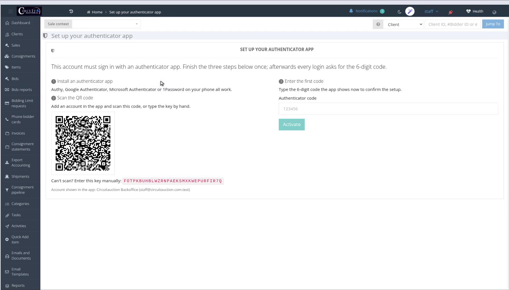

<!-- i18n source=logging-in-with-an-authenticator-app.md sha=ed6f1091e6f9 -->
# Anmelden mit einer Authenticator-App

Ab Version 3.5 kann das Backoffice Mitarbeiterkonten mit einer **Zwei-Faktor-Authentifizierung** schützen: Neben Benutzername und Passwort fragt jede Anmeldung einen sechsstelligen Code aus einer Authenticator-App auf Ihrem Smartphone ab, zum Beispiel Authy, Google Authenticator oder Microsoft Authenticator.

<video class="release-video" controls preload="metadata" playsinline src="https://circuit-kubernetes.s3.eu-central-1.amazonaws.com/openmontage/tutorials/release-3.5-authenticator-setup/final.mp4">Your browser does not support the video tag. <a href="https://circuit-kubernetes.s3.eu-central-1.amazonaws.com/openmontage/tutorials/release-3.5-authenticator-setup/final.mp4">Download the video</a>.</video>

## Erste Anmeldung: die App einrichten

Wenn Sie sich zum ersten Mal anmelden, nachdem die Funktion für Ihr Konto eingeschaltet wurde, führt das Backoffice Sie zuerst auf eine einmalige Einrichtungsseite **Authenticator app**. Andere Seiten können Sie erst öffnen, wenn die Einrichtung abgeschlossen ist.

1. **Installieren Sie eine Authenticator-App** auf Ihrem Smartphone (Authy, Google Authenticator und Microsoft Authenticator funktionieren alle).
2. **Scannen Sie den QR-Code**, der auf der Seite angezeigt wird, mit der App. Wenn Sie ihn nicht scannen können, fügen Sie das Konto in der App manuell hinzu und geben Sie den **manuellen Schlüssel** ein, der unter dem QR-Code steht.
3. Die App zeigt nun einen **sechsstelligen Code** an, der sich alle 30 Sekunden ändert. Geben Sie den aktuellen Code in das Feld **Code** ein und klicken Sie auf **Activate**.

Wenn der Code abgelehnt wird, warten Sie auf den nächsten Code in der App und versuchen Sie es erneut. Die Uhr Ihres Smartphones muss richtig gehen, damit die Codes übereinstimmen.

Nach der Aktivierung gelangen Sie wie gewohnt zum Dashboard.

## Jede weitere Anmeldung

Geben Sie Benutzername und Passwort wie bisher ein. Unter dem Passwort erscheint ein Feld **Code**: Geben Sie den aktuellen Code aus Ihrer App ein und klicken Sie auf **Log in**.

Wenn Sie sich mit Google anmelden, wird derselbe Code abgefragt, nachdem Google Ihr Konto bestätigt hat.

## Verlorenes oder ersetztes Smartphone

Die Codes befinden sich nur in der App auf Ihrem Smartphone. Wenn Sie es verlieren oder auf ein neues Smartphone wechseln, bitten Sie einen Administrator, die **Authenticator-App** für Ihr Benutzerkonto **zurückzusetzen** (die Option *Reset authenticator app* im Benutzerformular). Bei Ihrer nächsten Anmeldung erscheint dann wieder die Einrichtungsseite, sodass Sie das neue Smartphone registrieren können.

## Für Administratoren

- Die Funktion wird in den Servereinstellungen für die gesamte Installation eingeschaltet (*Require an authenticator app for staff logins*). Sie ist standardmäßig ausgeschaltet, sodass ein Upgrade niemanden aussperrt.
- Unabhängig von der Einstellung für die gesamte Installation kann ein Benutzerkonto mit **Always require an authenticator app for this account** markiert werden.
- Die Benutzerliste zeigt eine Spalte **Authenticator** mit dem Status jedes Kontos, und das Benutzerformular zeigt, ob die App aktiviert ist, und erlaubt das Zurücksetzen.
- Kundenkonten (Bieter) auf der Website sind nicht betroffen.

Siehe auch [Anmeldung am System](/de/logging-into-the-system.md).
