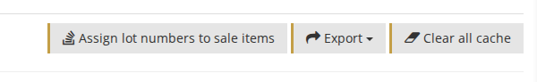
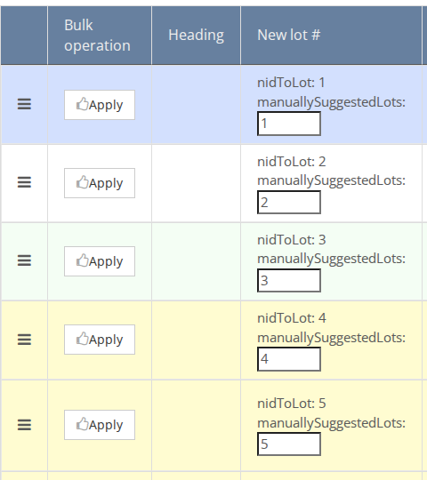
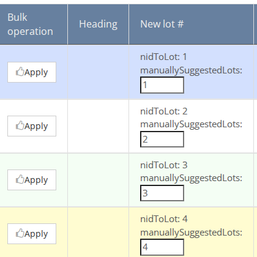
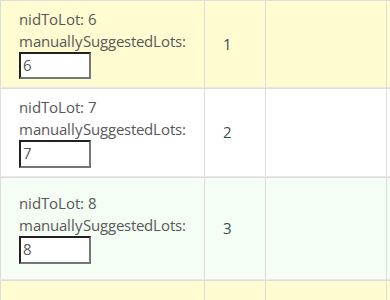
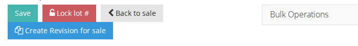

<!-- i18n source=sale/how-to-assign-lot-numbers.md sha=f1835a30c049 -->
# So vergeben Sie Losnummern

Nachdem [Lose zur Auktion hinzugefügt wurden](../items/how-to-create-an-item.md), können Sie allen Losen Losnummern zuweisen.

1. Klicken Sie auf `Losnummern vergeben` \(beachten Sie, dass diese Aktion nicht verfügbar ist, wenn der Auktionsstatus `Neu` ist\).

1. Auf der Seite für die Losnummerierung sehen Sie alle Lose der Auktion. Sie können die Losnummern auf verschiedene Arten ordnen, die sich kombinieren lassen.

**Sort by**  
Verwenden Sie die Schaltflächen **Sort by**, um die Lose zu sortieren, z. B. nach **Standardsortierung**, **Losnummern**, **temporäre Losnummer**, **Beschreibung**, **Kategorie** oder **Sammlung**.

**Drag and Drop**  
Klicken Sie auf das Drag-and-Drop-Symbol \(in der ersten Spalte\), um Lose nach oben oder unten zu verschieben.

**Losnummer eingeben**  
Geben Sie die neue Losnummer, die Sie dem Los zuweisen möchten, im Feld **neue Losnummer** ein und klicken Sie auf **Anwenden**. Das Los springt an diese Position.

Wenn Sie die Reihenfolge der Lose ändern, sehen Sie in der Tabelle die aktuelle **Losnummer** und die zuzuweisende **neue Losnummer**.

1. Sobald die Lose in der richtigen Reihenfolge sind, klicken Sie auf die Schaltfläche **speichern**. Die neuen Losnummern werden den Losen zugewiesen.

1. Um zu vermeiden, dass Losnummern nach der Veröffentlichung einer Auktion geändert werden, können Sie die Losnummerierung nach Abschluss sperren. Klicken Sie auf die Schaltfläche **Losnummer sperren**, um die Auktion zu sperren. Wenn Sie nach dem Sperren Änderungen vornehmen möchten, klicken Sie einfach erneut auf dieselbe Schaltfläche, um die Sperre aufzuheben.

