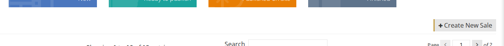
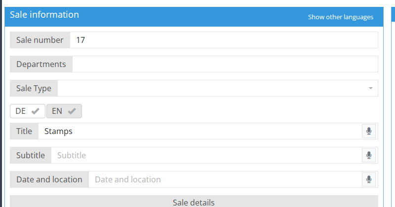

<!-- i18n source=sale/how-to-create-a-sale.md sha=8cb5de522600 -->
# So legen Sie eine Auktion an

1. Gehen Sie im Seitenmenü zu **Auktionen**
2. Klicken Sie auf `neue Auktion anlegen`

1. Geben Sie die Informationen zur Auktion ein. Achten Sie dabei besonders auf diese Felder:  

**Auktionsnummer** - Geben Sie eine Nummer ein, die als interne ID für Berichte und Nachverfolgung verwendet wird.

**Auktionsinformation** - Sie können die Beschreibung der Auktion in mehreren Sprachen eingeben. Dieser Inhalt wird auf der Webseite angezeigt. Klicken Sie auf eine der Sprachschaltflächen \(z. B. EN, DE, HE usw.\), um die Felder der Auktionsinformation in der gewählten Sprache auszufüllen. Klicken Sie zum Beispiel auf die Schaltfläche EN und füllen Sie Titel, Untertitel und Auktionsdetails auf Englisch aus. Klicken Sie dann auf die Schaltfläche DE und füllen Sie dieselben Felder auf Deutsch aus.

Um den Inhalt gleichzeitig in mehreren Sprachen anzuzeigen, klicken Sie auf „weitere Sprachen“ und nutzen Sie den Block der weiteren Sprachen, um das Los bequem zu übersetzen, während Sie beide Sprachen sehen.

**Next consignment notice** - Geben Sie eine Nachricht ein, die in der Einlieferungsabrechnung erscheint.

**Auktionsbild** - Das Hauptbild der Auktion, das auf der Webseite angezeigt wird.

**Auktionsdatum** - In diesem Block legen Sie fest, um welche Art von Auktion es sich handelt, und setzen die Termine der Auktion. **Hinweis:** Die Termine dienen nur zur Information, das heißt, die Auktion wird beim Erreichen des Datums nicht automatisch geöffnet.

**Sessions** - Wenn Sie die Auktion in Sessions aufteilen möchten, können Sie diese im Tab **Sessions** anordnen.

**Einlieferungsschluß** - Nach diesem Datum können dieser Auktion keine neuen Einlieferungen mehr hinzugefügt werden.

1. Wenn Sie die Auktionsdaten eingegeben haben, klicken Sie auf **speichern**.  Sie können jederzeit zurückkehren und die Auktion bearbeiten.

Siehe auch:  
[So laden Sie Losbilder gesammelt hoch](/de/sale/how-to-mass-upload-items-images.md)  
[So vergeben Sie Losnummern](/de/sale/how-to-assign-lot-numbers.md)  
[Auktionsstatus](./)
