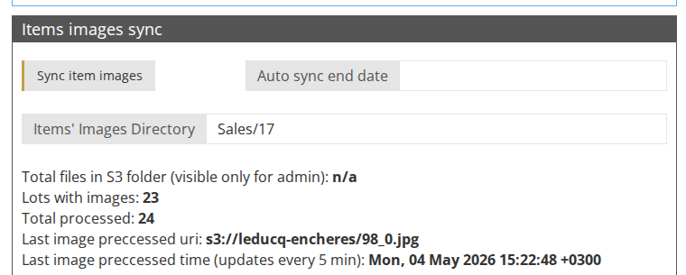

<!-- i18n source=sale/how-to-mass-upload-items-images.md sha=0ae1c952bf95 -->
# So laden Sie Losbilder gesammelt hoch

Sie können allen Losen einer Auktion Bilder hinzufügen, ohne sie einzeln manuell hochladen zu müssen.

1. Bereiten Sie die Bilddateien vor: Damit die Bilder den Losen zugeordnet werden können, müssen Sie der Datei einen Namen nach einem Muster geben, der die Item ID enthält \(die ID wird neben dem Titel des Loses angezeigt\).

   Beispiel: Für die Item ID 777 nennen Sie die Bilddatei `777.png`.

   Wenn Sie mehrere Bilder für ein Los haben, verwenden Sie zur Kennzeichnung den Unterstrich \( \_ \).

   Beispiel: Dem Los mit der Item ID 777 werden folgende Bilder zugeordnet: `777.png`, `777_1.png`, `777_abc.jpg` usw.

1. Öffnen Sie Ihren Amazon-S3-Bucket und legen Sie ein Verzeichnis für die Auktion an. Der genaue Verzeichnisname wird im Feld **Bildverzeichnis** im Block **Bildaktualisierung** auf der Auktionsseite angezeigt \(z. B. `Sales/17`\).

1. Laden Sie alle Bilder der Auktion in das Amazon-Verzeichnis hoch.
2. Klicken Sie auf der Auktionsseite im Block **Bildaktualisierung** auf **Sync Losbilder**, um die Bilder von Amazon mit Ihrem System zu synchronisieren. Der Block zeigt außerdem den Fortschritt der Synchronisierung an \(Lose mit Bildern, insgesamt verarbeitet und zuletzt verarbeitetes Bild\).

