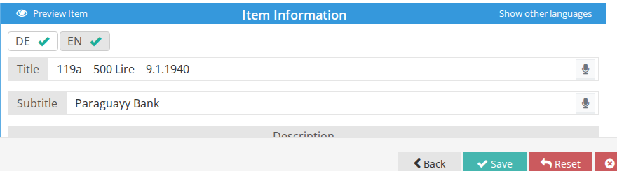

# How to Create an Item

Usually [an item is created directly from Consignment](../consignment/how-to-add-an-item-to-consignment.md) except when an item is from the auction house inventory. You may also create an item using the **Items** menu.

1. Make sure you are on the right [sale context](../sale/sale-context.md).
2. Go to the consignment page.
3. Click on `+ Add new item to consignment` (or `Quick Add Item`).

1. Fill in the item's information, paying special attention to these fields:

**Item Information** - you can enter the item description in several languages. Click on one of the language buttons \(i.e EN, DE, HE etc.\) to fill in the item information fields in the chosen language. For example: click on EN button and fill in the **Title**, **Subtitle** and **Description** in English. Then click the DE button and fill in the same fields in German.

To show the content simultaneously in multiple languages, click on **Show other languages** and use the other languages block to easily translate the item while viewing both languages.

**Images** - Click on **Select image** and choose the item image from your local folder.  
You can add images to all sale's items without the need to manually upload them one by one. See [How to Mass Upload Item Images](../sale/how-to-mass-upload-items-images.md).

**Lot numbering** - the sale the item belongs to is shown in this block. You can move the item to another sale later \(see [How to Assign Bulk Items to a Sale](../sale/how-to-assign-bulk-items-to-a-sale.md)\).

In the **Temporary lot #** field you can enter a temporary number assigned to this lot before the [final lot number](../sale/how-to-assign-lot-numbers.md) is added.

**Packages** - add the package type and dimensions. This will be used to calculate the shipping costs.

**Public message** - you can add a special message that will display to _ALL_ bidders when this lot is the active lot during a live auction.

**Auctioneer Notes** - add a private message that is only displayed on the auctioneer screen when this lot is the active lot during a live auction.

**Consignment & Accounting** - an item should always be associated with a consignment. Here you can also set the position of consignment, commissions and tax settings.

**Withdrawn** \(in the `Actions on website` block\) - an item marked as "withdrawn" will appear as part of the sale, but will be disabled for bidding. Use this if you have added an item to the sale, but there is a problem with it, and you can’t offer it at the live auction.

1. When you've finished entering the item information, click **Save**.  You can always come back and edit the item.

