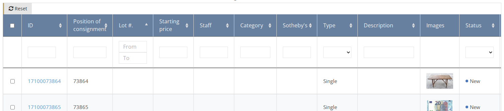
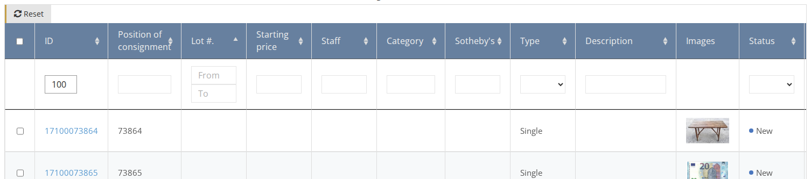

# How to Find an Existing Item

1. Select the relevant sale or remove the [sale context](../sale/sale-context.md) if you want to search in all items. 
2. On the side menu go to **Items**.
3. You have multiple ways to find an item in the table:

## Sorting

Click on the column header which you want to sort by.  
For example, click on the `Lot` column header to sort the list by the items' lot numbers. Click again to change the order from ascending to descending and vice-versa.

## Filtering by column

On the column header, enter or select the value you want to filter by. For example, enter the Item ID to find a specific item or select a status in order to filter the list by a specific status.

After you find the desired item, click on the Item ID link to enter the Item page.

