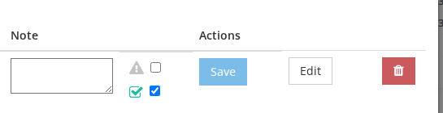
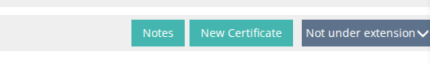
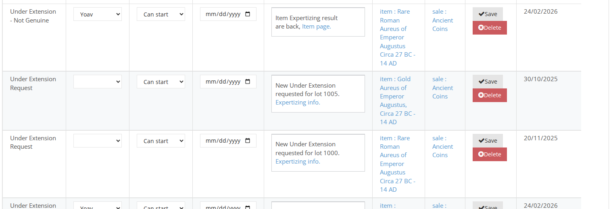
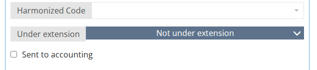

# Under extension worflow

### How to set an item as Under extension

#### 1. From the Backoffice bid page

&#x20;Flag UE through the Backoffice app.\

#### 2. From live app

On the Auctioneer page, this will be visible next to the mail bid..png>)

#### 3. From the Backoffice item page

Another way is to mark the UE flag on the item page, this is used to send expertizing tasks before the auction starts.

Note: Bids marked with UE, will trigger the workflow when item is sold with this bid.

### &#x20;Workflow steps

1. &#x20;A task for the philatelist will be created. 
2. The item on the CS will appear as UE, and will not be added to the total payable.  .png>)
3. The item page will display the UE status: 
4. Note: Changing the UE status when CS is closed, will trigger a new CS only in case the payment was omitted from the initial payment.
5. You can track all the requests in the Order tab, Expert Orders tab

.png>)\

