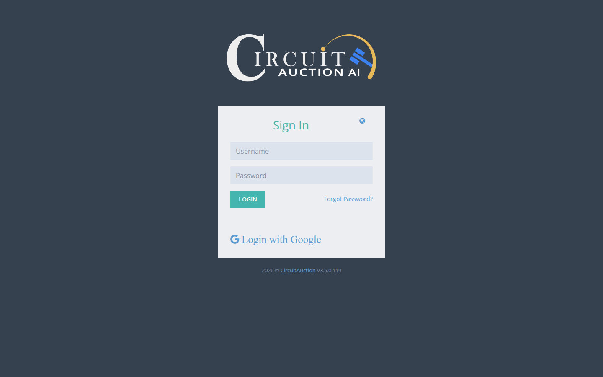
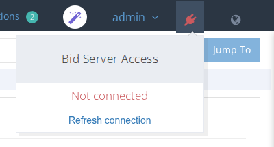

# Logging into the System

Open the web browser \(the latest version of Chrome is recommended\) and enter the system URL.

Log in with your Username and Password.

If your account is protected with two-factor authentication, a **Code** field also asks for the current code from your authenticator app. See [Logging in with an Authenticator App](logging-in-with-an-authenticator-app.md).

Make sure the Bid Server Connection icon is green. This means that the data is synchronized correctly with the Bid system. 

If the icon is red, click on it and then click on **Refresh connection**.

When logged in, you will see the main dashboard and the sidebar menu. This allows you to navigate through the system functions.

