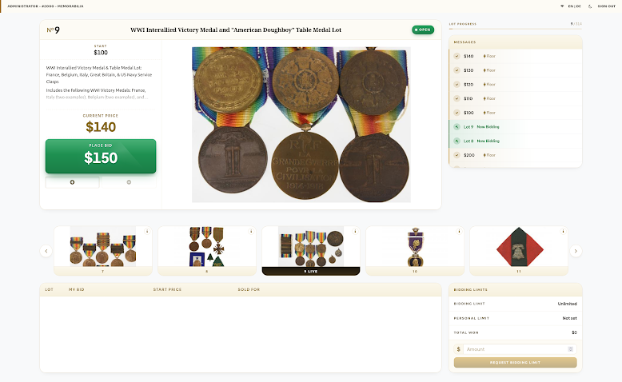
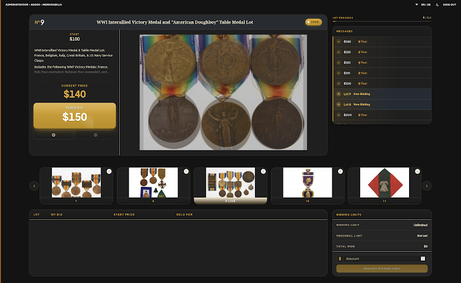
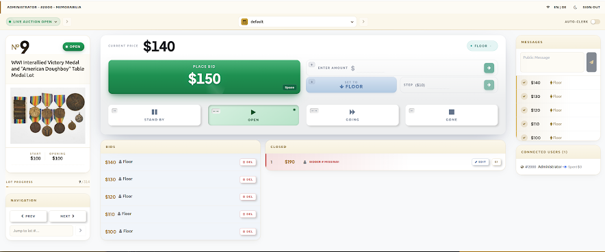
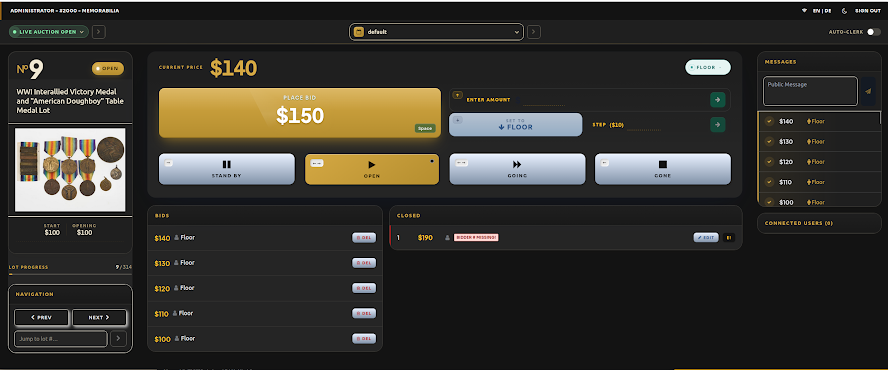
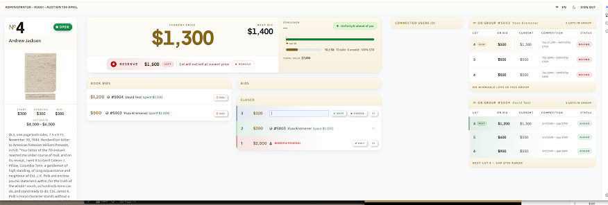
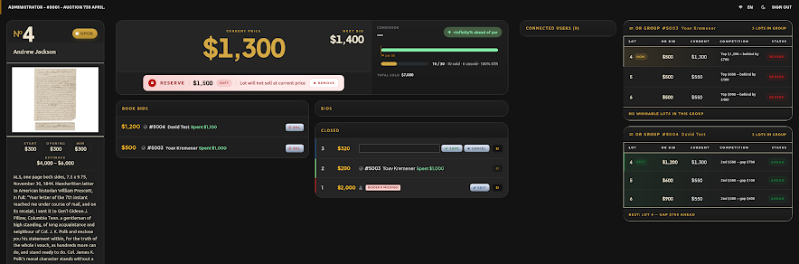
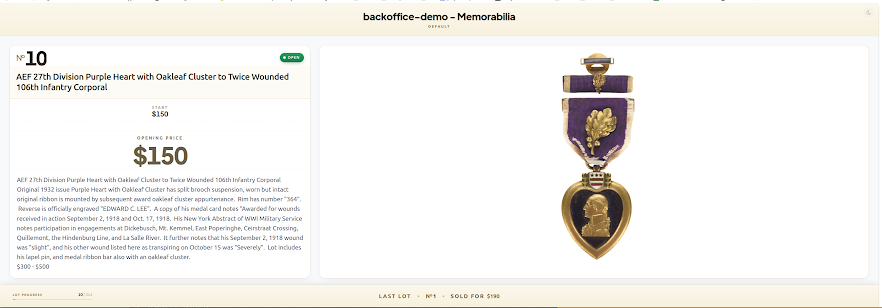
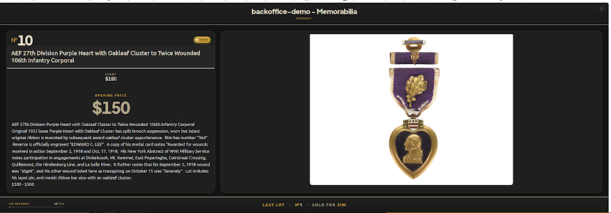

# Version 3.3

Released May 2026. This version delivers a redesign of every live sale screen, a substantial shipping overhaul with ShipStation integration, and faster image loading.

## Live Sale Experience

### New display design on all live screens

The whole live sale experience has been redesigned. The auctioneer, clerk, bidder and room screens have cleaner, more spacious layouts that show more information at a glance, see [Auction](../auction/README.md).

### Light and dark display modes

Live app pages have a display mode switcher. Toggle between light and dark mode to suit the room and lighting setup.

Bidder screen:

### Ergonomic clerk screen: run the sale without a mouse

The clerk screen was re-engineered for keyboard-driven operation. The whole sale can be run from the keyboard:

| Key | Action |
|-----|--------|
| Space | Place the next bid |
| Left / Right arrows | Move through item statuses (sold, passed, ...) |
| Down arrow | Set to floor |
| Up arrow | Open the enter bid amount field |

See [The Clerk Screen](../auction/clerk-screen/README.md) for the full description.

### Live consignor stats on the auctioneer screen

An always-visible panel on the auctioneer screen shows real-time statistics for the current lot's consignor: start prices, estimates, and running sold/unsold totals in amount and item count. It updates automatically after every lot.

### Hidden reserve enhancements

- A colour indicator shows the reserve status to auctioneers and clerks: red until the reserve is met, green once it is met. Bidders never see it.
- Auctioneers can release the reserve mid-sale with a single click.
- Items hammered below an unreleased reserve are automatically marked as no-sale / passed.

### Connected users moved to the top

The connected online bidders block now sits at the top of the auctioneer screen for better visibility throughout the sale.

### Image gallery on bidder and room screens

Lots with several images show an automatic gallery of up to three images. Each image is displayed for eight seconds with a fade transition. Hover over the gallery to pause it.

## Shipping

A significant overhaul of the end-to-end shipping workflow.

### ShipStation integration

ShipStation is available alongside the existing shipping options. Tracking numbers and labels are pulled directly into Circuit.

### Redesigned shipping screens

Refreshed interface for the shipping orders dashboard, the label and packing slip page, and the shipping settings.

### Smarter rate calculation

The rate logic supports dimensional weight, zones, multi-package orders, custom rate rules and tiers, and insurance and handling fees.

### Improved status workflow

New shipping statuses (packed, ready, shipped, delivered), automatic status updates pulled from the carriers, and bulk status updates for high-volume operations.

### Packing inventory

Track exactly which items are packed into which box or package.

### Scan & pack

Scan item barcodes to assign them to packages for faster, error-free packing.

## Performance

### Faster image loading

Thumbnails are generated in WebP and AVIF formats and in fewer sizes, which gives faster page loads and lower storage costs. This applies to new uploads.
