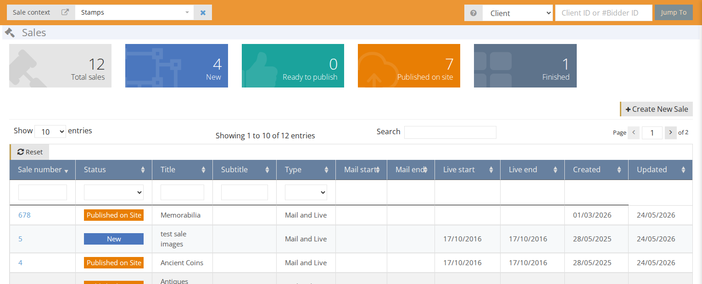
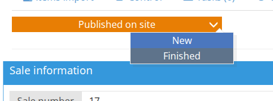

# Sale

A sale is a group of lots \(items\) you will auction in one event. A sale can be 10 lots or 10,000 lots sold over 5 days.

On the Sale dashboard you can find an overview of all sales and their status.

The color boxes on the top **\[1\]** display the total sales and the number of sales on each status.

The table **\[2\]** displays the Sales list which you can [filter](how-to-find-an-existing-sale.md) by any column.

## Statuses

**New** - A new sale is created and is being edited. A sale with this status is not published on the website.  
**Ready to publish** - This status will trigger a sync to the website. When completed, the status will change to `Published on site`.  
**Published on site** - The sale is published on the website.  
**Finished** - A closed sale from a past auction.

**Note**: if you want to make a change to a published sale, you need first to change the status back to `New` and when you are done, set the status to `Ready to publish` so the changes will be synced to the website.

