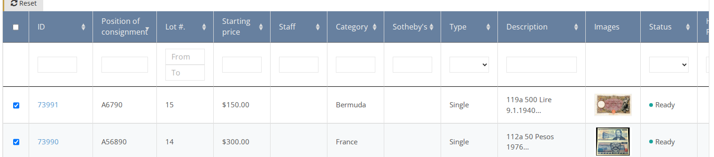
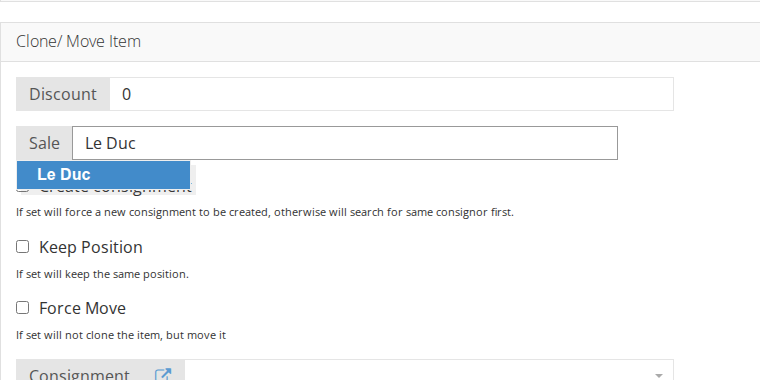
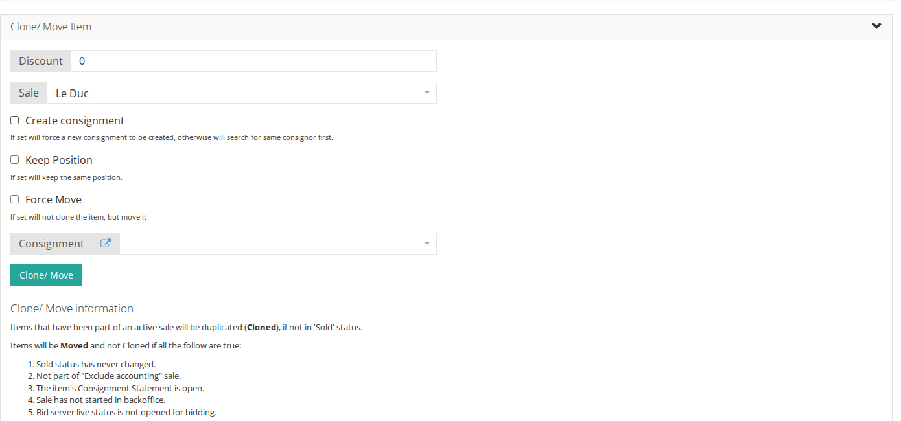

# How to Assign Bulk Items to a Sale

1. On the side menu go to **Items**
2. Select the desired items from the list \(see [How to Find an Existing Item](../items/how-to-find-an-existing-item.md)\). You can select specific item\(s\) or check the checkbox in the header to select all items.

1. Open the `Clone/ Move Item` panel, start typing the Sale ID and select the desired sale from the autocomplete list.

1. Click on `Clone/ Move`. All selected items will be assigned to the selected sale.

