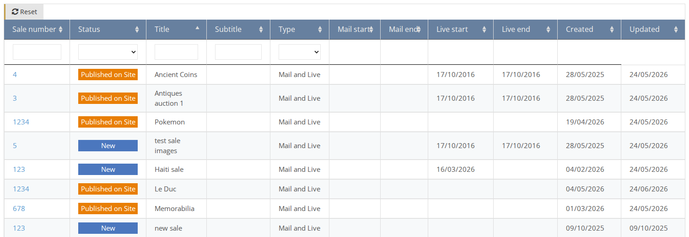
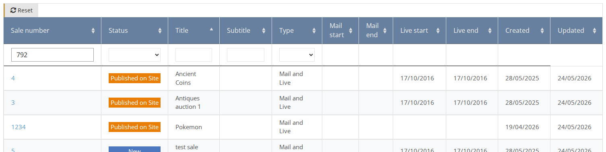

# How to Find an Existing Sale

1. On the side menu go to **Sales**.
2. You have multiple ways to find a Sale in the table:

## Sorting

Click on the column header that you want to sort by.  
For example, click on the `Title` column header to sort the list by sales' title. Click again to change the order from ascending to descending and vice-versa.

## Filtering by column

On the column header enter or select the value you want to filter by. For example, enter the Sale ID to find a specific sale or select a Type to filter the list by specific type.

After you find the desired sale, click on the sale Title link to enter the Sale page.

