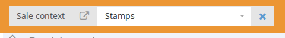

# Sale Context

Most of the information in the backoffice platform is managed as part of a specific sale, meaning when you create or watch the data \(client's bids, items, consignments, etc.\) it will display only the data related to that selected sale.

## Selecting Sale context

On top of the screen start typing the Sale ID or Sale name and select the desired sale from the autocomplete list.

When the desired sale is selected you will see the Sale context on the top.

## Removing Sale context

It is recommended to always work with a Sale context, but if for some reason you want to remove the Sale context, just click on **Remove context**.  
Note that when removing the sale context, some of the data won't display correctly.

