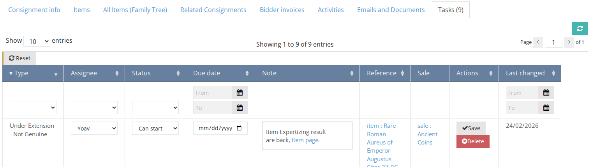
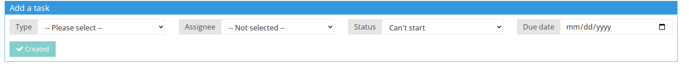
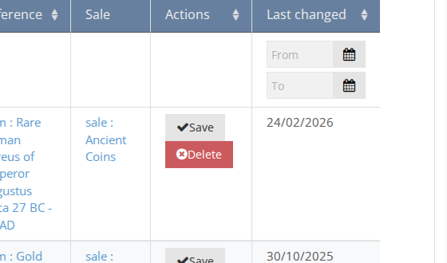
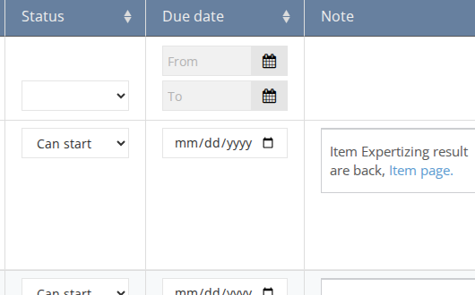

# Tasks

You can create different types of tasks and assign them to different people in your organization. Tasks can be created for clients, consignments, items, sales, and orders.

1. Go to the entity page (client, consignment, item, sale, or order) you want to create a task for.
2. Click on the **Tasks** button. The number on the button represents the number of the active (not complete) tasks.

### Creating a new task
1. Fill in the fields under `Add a task`   
**Task** - enter the name of the task, or select task from the list.  
**Assignee** - select the user in the system that is assigned to do the task.  
**Due date** - enter the date on which the task is expected to be complete.  
2. click on `+` button. 

### Deleting task
click on the `X` sign near the task. 

### Marking task as complete
Once a task is done, mark it as complete in the task list, by selecting the checkbox.

### Default / Dependent tasks
In the backend of the system, Admin can define**default tasks** that will be created automatically. For example: every time an item is created, tasks such as “Describe item” and "Photograph" will be created and assigned to the right staff member.
Admin can also define **dependent tasks**. For example: a task to “proofread” an item can only start after the task to “Describe item” is complete.
